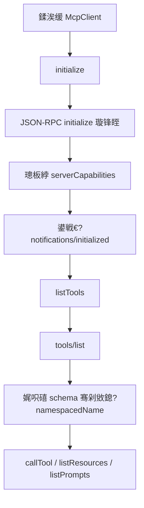
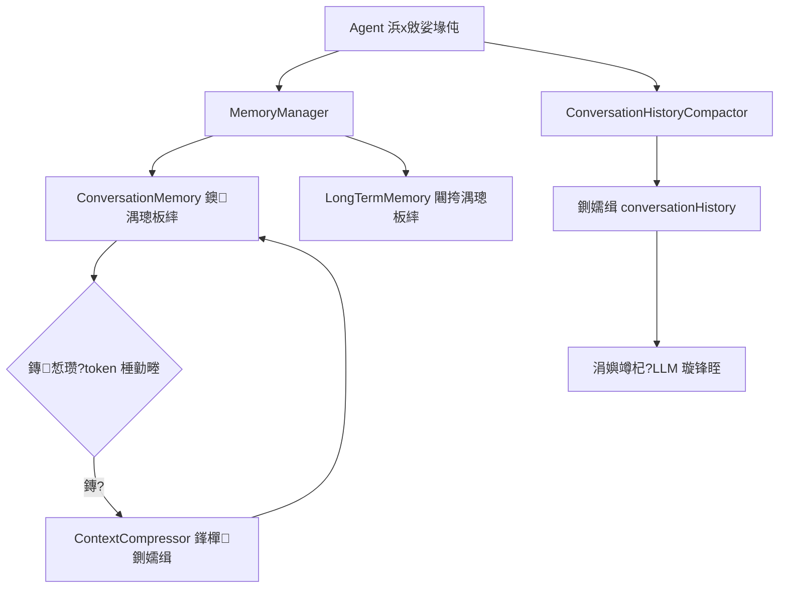

# CodeCLI 鏍稿績妯″潡璇︾粏鍒嗘瀽

> 鐗堟湰: v16.1.0  
> 鏃ユ湡: 2026-08-18

## 鐩綍

1. [Agent 鏍稿績寮曟搸](#1-agent-鏍稿績寮曟搸)
2. [LLM 澶氭ā鍨嬮€傞厤灞俔(#2-llm-澶氭ā鍨嬮€傞厤灞?
3. [MCP 鍗忚妯″潡](#3-mcp-鍗忚妯″潡)
4. [Memory + 涓婁笅鏂囧伐绋媇(#4-memory--涓婁笅鏂囧伐绋?
5. [ToolRegistry 宸ュ叿娉ㄥ唽涓庡畨鍏ㄧ瓥鐣(#5-toolregistry-宸ュ叿娉ㄥ唽涓庡畨鍏ㄧ瓥鐣?
6. [Prompt 鍒嗗眰鏋舵瀯](#6-prompt-鍒嗗眰鏋舵瀯)

---

## 1. Agent 鏍稿績寮曟搸

**鍖呰矾寰?*: `com.CodeCLI.agent`  
**鏍稿績绫?*: `Agent`, `PlanExecuteAgent`, `AgentOrchestrator`, `SubAgent`, `AgentBudget`

### 1.1 ReAct 妯″紡 (`Agent.java`)

```mermaid
flowchart TD
    A[鐢ㄦ埛杈撳叆浠诲姟] --> B[棰勫鐞? 鍥剧墖瑁佸壀 / 璁板繂鍐欏叆 / Skill 娉ㄥ叆]
    B --> C[妫€绱㈤暱鏈熻蹇嗗苟鏇存柊 system prompt]
    C --> D[娉ㄥ叆 LSP 璇婃柇涓庝笂涓嬫枃鍘嬬缉]
    D --> E[璋冪敤 LLM]
    E --> F{鏄惁鏈?tool_calls?}
    F -- 鏄?--> G[骞惰鎵ц宸ュ叿]
    G --> H[宸ュ叿缁撴灉鍥炵亴 conversationHistory]
    H --> D
    F -- 鍚?--> I[鍐欏叆璁板繂骞惰繑鍥炴渶缁堢瓟妗圿
```

ReAct锛圧easoning + Acting锛夋槸 CodeCLI 鐨勯粯璁?Agent 妯″紡銆傛牳蹇冨疄鐜版槸涓€涓?`while(true)` 涓诲惊鐜紝姣忚疆鎵ц浠ヤ笅姝ラ锛?
**寰幆娴佺▼**:

1. **鍓嶇疆澶勭悊**:
   - `pruneHistoricalImagePayloads()`: 娓呴櫎鍘嗗彶娑堟伅涓殑鍥剧墖 payload锛堥伩鍏嶅巻鍙插浘鐗囧崰鐢?token锛?   - `memoryManager.addUserMessage(userInput)`: 瀛樺叆鐭湡璁板繂
   - `storeExplicitBrowserMemoryHint()`: 妫€娴嬬敤鎴疯緭鍏ヤ腑鐨勬祻瑙堝櫒鐧诲綍鎻愮ず锛岃嚜鍔ㄥ瓨鍏ラ暱鏈熻蹇?   - `memoryManager.buildContextForQuery()`: 妫€绱㈢浉鍏抽暱鏈熻蹇嗭紝娉ㄥ叆鍒?system prompt
   - `prependSkillBodies()`: 濡傛湁 Skill body 娉ㄥ叆锛屽墠缃埌鐢ㄦ埛杈撳叆涔嬪墠

2. **棰勭畻妫€鏌?*: 姣忚疆璋冪敤 `budget.check()` 妫€鏌ヤ笁涓厹搴曟潯浠?3. **涓婁笅鏂囧帇缂?*: `maybeCompactHistory()` 鍦ㄨ皟 LLM 鍓嶈瘎浼?conversationHistory 鏄惁鎺ヨ繎绐楀彛涓婇檺
4. **LSP 璇婃柇娉ㄥ叆**: `injectPendingLspDiagnostics()` 灏嗗緟澶勭悊鐨?LSP 璇婃柇浣滀负 user 娑堟伅娉ㄥ叆
5. **LLM 璋冪敤**: `llmClient.chat(conversationHistory, toolDefinitions, streamRenderer)` 鍙戣捣 SSE 娴佸紡璇锋眰
6. **鍒嗘敮鍒ゆ柇**:
   - 鏈?tool_calls 鈫?骞惰鎵ц宸ュ叿 鈫?缁撴灉鍥炵亴 conversationHistory 鈫?`continue` 缁х画寰幆
   - 鏃?tool_calls 鈫?瀛樺叆璁板繂 鈫?杩斿洖鏈€缁堢粨鏋?
**閫€鍑烘潯浠?* (涓诲鏉冨湪 LLM 鑷韩锛宐udget 浠呭仛鍏滃簳):
- **涓婚€€鍑?*: LLM 杩斿洖 content 涓斾笉鍐嶈皟鐢ㄥ伐鍏?- **Token 棰勭畻**: 绱 input+output 瓒呰繃闃堝€硷紙榛樿 `Integer.MAX_VALUE`锛屽彲閫氳繃 `-DCodeCLI.react.token.budget=N` 鏄惧紡鍚敤锛?- **鍋滄粸妫€娴?*: 杩炵画 N 杞紙榛樿 3锛夊伐鍏疯皟鐢ㄧ殑"宸ュ叿鍚?鍙傛暟"瀹屽叏鐩稿悓锛屽垽瀹氭寰幆
- **纭疆鏁板厹搴?*: 绱杩唬瓒呰繃 50 杞紙鍙€氳繃 `-DCodeCLI.react.hard.max.iterations=N` 璋冩暣锛?- **鐢ㄦ埛鍙栨秷**: `CancellationContext.isCancelled()` 妫€鏌ュ彇娑堜俊鍙?
**娴佸紡娓叉煋鍣?(`StreamRenderer` 鍐呴儴绫?**:

璐熻矗灏?SSE 娴佷腑鐨?`reasoning_content` 鍜?`content` 鍒嗗尯灞曠ず銆傛牳蹇冪姸鎬佹満:

| 鐘舵€?| 鍚箟 | 琛屼负 |
|------|------|------|
| `reasoningStarted = false` | 灏氭湭寮€濮嬫帹鐞?| 鏀掑埌鏈夋崲琛岀殑瀹炶川鍐呭鍚庢墠鎵撳嵃"馃 鎬濊€冭繃绋?鏍囬 |
| `reasoningStarted = true` | 鎺ㄧ悊杩涜涓?| 鍚庣画 reasoning delta 鐩存帴娴佸紡杩藉姞 |
| `contentStarted = true` | 姝ｆ枃寮€濮?| 鏀跺熬鎺ㄧ悊鍖猴紝鐢?`鈻猔 鏍囪杩涘叆姝ｆ枃锛宑ontent delta 娴佸紡杈撳嚭 |
| `lateReasoning` | content 涔嬪悗鍙堟敹鍒?reasoning | 缂撳啿鍒?馃 琛ュ厖鎬濊€?鐙珛灞曠ず |

濡傛灉 `Renderer` 鏀寔 `thinkingPanel`锛堝 Lanterna TUI锛夛紝reasoning 鍐欏叆鐙珛闈㈡澘鑰岄潪缁堢琛屻€?
**绯荤粺 Prompt 鍔ㄦ€佹瀯寤?*:

```
buildSystemPrompt(memoryContext)
  鈫?PromptAssembler.assemble(PromptMode.AGENT, PromptContext)
    鈫?base.md + personalities/calm.md + modes/agent.md + approvals/妯″紡.md
      + runtime_context + project_context + skills + context-management.md + handoff.md
```

姣忚疆鐢ㄦ埛杈撳叆鏃堕€氳繃 `updateSystemPromptWithMemory()` 鏇挎崲 `conversationHistory[0]`锛坰ystem message锛夈€?
### 1.2 Plan-and-Execute 妯″紡 (`PlanExecuteAgent.java`)

```mermaid
flowchart TD
    A[鐢ㄦ埛鐩爣] --> B[Planner 鐢熸垚 ExecutionPlan]
    B --> C[鐢ㄦ埛纭 / 琛ュ厖 / 鍙栨秷]
    C -->|鎵ц| D[瑙ｆ瀽 DAG 浠诲姟鍥綸
    C -->|琛ュ厖| B
    C -->|鍙栨秷| Z[缁撴潫]
    D --> E[鎸変緷璧栫瓫閫夊彲鎵ц浠诲姟]
    E --> F{褰撳墠鎵规浠诲姟鏁皚
    F -- 1 --> G[鍗曚换鍔′覆琛屾墽琛宂
    F -- >1 --> H[澶氫换鍔″苟琛屾墽琛宂
    G --> I[浠诲姟瀹屾垚/澶辫触澶勭悊]
    H --> I
    I --> J{鏄惁瀛樺湪澶辫触涓旇繘搴?50%?}
    J -- 鏄?--> K[閲嶆柊瑙勫垝]
    K --> B
    J -- 鍚?--> L[杈撳嚭鏈€缁堢粨鏋淽
```

鍏堣鍒掑悗鎵ц鐨勪袱闃舵妯″紡锛?
**闃舵涓€ 鈥?瑙勫垝**:
- `Planner.createPlan(goal)` 璋冪敤 LLM 鐢熸垚 `ExecutionPlan`锛圝SON 鏍煎紡鐨?DAG 浠诲姟鍥撅級
- `PlanReviewHandler.review()` 璁╃敤鎴风‘璁よ鍒掞紝鏀寔涓夌鍐崇瓥:
  - `EXECUTE`: 鐩存帴鎵ц
  - `SUPPLEMENT`: 甯﹀弽棣堥噸鏂拌鍒掞紙鎶婅ˉ鍏呰姹傛嫾鎺ュ埌 goal 鍚庡啀璋?`createPlan`锛?  - `CANCEL`: 鍙栨秷鎵ц

**闃舵浜?鈥?鎵ц**:
- `getExecutableTasksInOrder(plan)`: 鎸変緷璧栨嫇鎵戞帓搴忔壘鍑哄綋鍓嶅彲鎵ц鐨勪换鍔★紙渚濊禆宸插叏閮ㄥ畬鎴愮殑浠诲姟锛?- 鍗曚釜浠诲姟鐩存帴涓茶娴佸紡杈撳嚭锛屽涓嫭绔嬩换鍔″彲骞惰
- 姣忎釜浠诲姟鐢ㄤ竴涓嫭绔嬬殑 ReAct Agent锛堝叡浜?ToolRegistry 鍜?LlmClient锛夋墽琛?- 濡傛灉杩涘害 < 50% 鏃舵煇浠诲姟澶辫触锛岃嚜鍔ㄨЕ鍙?`planner.replan()` 閲嶆柊瑙勫垝

### 1.3 Multi-Agent 妯″紡 (`AgentOrchestrator.java`)

```mermaid
flowchart TD
    A[鐢ㄦ埛浠诲姟] --> B[Planner 鐢熸垚 JSON 璁″垝]
    B --> C[parsePlan 杞负 ExecutionStep DAG]
    C --> D[绛涢€夊綋鍓嶅彲鎵ц姝ラ]
    D --> E{鎵规鏄惁鍙湁 1 涓楠
    E -- 鏄?--> F[鍗曟涓茶鎵ц]
    E -- 鍚?--> G[Worker Pool 骞惰鎵ц]
    G --> H[鐙珛 Reviewer 瀹℃煡]
    F --> H
    H --> I{瀹℃煡閫氳繃?}
    I -- 鏄?--> J[鏍囪 COMPLETED]
    I -- 鍚?--> K[鏈€澶氶噸璇?2 娆
    K --> L{閲嶈瘯鎴愬姛?}
    L -- 鏄?--> J
    L -- 鍚?--> M[鏍囪 FAILED]
    J --> D
    M --> D
    D --> N{杩樻湁鏈畬鎴愭楠?}
    N -- 鏄?--> D
    N -- 鍚?--> O[姹囨€绘渶缁堢粨鏋淽
```

涓讳粠鏋舵瀯锛屼笁涓鑹插崗浣滐細

**瑙掕壊瀹氫箟**:

| 瑙掕壊 | 绫?| PromptMode | 鑱岃矗 |
|------|----|------------|------|
| Planner | `SubAgent("planner", PLANNER)` | `TEAM_PLANNER` | 鎷嗚В鐢ㄦ埛浠诲姟涓?JSON 鏍煎紡鐨勬墽琛屾楠?DAG |
| Worker | `SubAgent("worker-1/2", WORKER)` | `TEAM_WORKER` | 鎵ц鍏蜂綋姝ラ锛屽彲璋冪敤鍏ㄩ儴宸ュ叿 |
| Reviewer | `SubAgent("reviewer", REVIEWER)` | `TEAM_REVIEWER` | 瀹℃煡 Worker 杈撳嚭锛岃繑鍥?`{approved: bool, issues: []}` |

**鍗忎綔娴佺▼**:

1. Planner 鎺ユ敹鐢ㄦ埛浠诲姟 鈫?杈撳嚭 JSON 璁″垝
2. `parsePlan()` 瑙ｆ瀽 JSON 涓?`ExecutionStep` 鍒楄〃锛岃嚜鍔ㄩ噸缂栧彿涓?`step_1, step_2...`锛屽缓绔嬩緷璧栨槧灏?3. `getExecutableSteps()` 鎸?DAG 渚濊禆鎵惧嚭褰撳墠鍙墽琛屾楠わ紙鎵€鏈変緷璧栧凡 COMPLETED锛?4. **涓茶/骞惰鍒嗘敮**:
   - 鍗曟鎵规: 鐩存帴璋冪敤 `runStep()`锛屾祦寮忚緭鍑哄埌 stdout锛屼繚鎸?瀹炴椂鎵撳瓧"瑙傛劅
   - 澶氭鎵规: `runBatchParallel()` 鐢?`FixedThreadPool` 骞惰鎵ц锛屾瘡姝?
     - 浠?`BlockingQueue` 姹犲寲鑾峰彇 Worker锛堥伩鍏嶅悓涓€ Worker 琚袱涓楠ゅ苟鍙戝崰鐢級
     - 鍒涘缓鐙珛鐨?Reviewer 瀹炰緥锛堥伩鍏嶅璇濆巻鍙茬珵浜夛級
     - 娴佸紡杈撳嚭鍐欏叆姝ラ鏈湴鐨?`ByteArrayOutputStream`
     - 鎵€鏈変换鍔″畬鎴愬悗鎸?`step_id` 椤哄簭 flush 鍒?stdout
5. **瀹℃煡 + 閲嶈瘯**: Reviewer 瀹℃煡鏈€氳繃鏃讹紝甯︿笂 `issues` 鍙嶉閲嶆柊鎵ц锛屾渶澶氶噸璇?2 娆★紙`MAX_RETRIES_PER_STEP`锛?6. 姹囨€绘墍鏈夋楠ょ姸鎬佺敓鎴愭渶缁堟姤鍛?
**Worker 姹犲寲璁捐**:
```java
BlockingQueue<SubAgent> workerPool = new LinkedBlockingQueue<>(workers);
```

### 1.6 涓庣畝鍘嗙偣瀵归綈鐨勫疄鐜扮粏鑺?
浣犵畝鍘嗛噷鍐欑殑鈥淧lanner->Worker脳N->Reviewer 涓夐樁娈电紪鎺掆€濆拰婧愮爜鏄竴涓€瀵瑰簲鐨勶細

- **Planner 闃舵**锛歚planner.execute(...)` 鍏堜骇鍑哄彲瑙ｆ瀽鐨?JSON 璁″垝
- **Worker 闃舵**锛歚runStep()` 璋冪敤 Worker 鎵ц鍏蜂綋姝ラ锛屽繀瑕佹椂鍙啀娆¤蛋宸ュ叿閾?- **Reviewer 闃舵**锛歚reviewer.review(...)` 瀵圭粨鏋滃仛缁撴瀯鍖栧鏌ワ紝杩斿洖 `approved` 鍜?`issues`

DAG 渚濊禆涓嶆槸鍙湪鎻忚堪灞傞潰瀛樺湪锛岃€屾槸 `parsePlan()` 鎶婅鍒掓樉寮忚浆鎴?`ExecutionStep` 鍥剧粨鏋勶紝鍐嶇敱 `getExecutableSteps()` 閫愯疆绛涘嚭鈥滀緷璧栧凡婊¤冻鈥濈殑姝ラ鎵ц锛屾墍浠ュぉ鐒舵敮鎸佹嫇鎵戞帓搴忓拰鍒嗘壒璋冨害銆?
骞惰鎺у埗鐐逛篃寰堟槑纭細

- **Worker Pool**锛歚BlockingQueue<SubAgent>` 淇濊瘉鍚屼竴涓?Worker 涓嶄細琚袱涓楠ゅ苟鍙戝崰鐢?- **鐙珛缂撳啿**锛氬苟琛屾楠ゅ厛鍐欏叆鑷繁鐨?`ByteArrayOutputStream`
- **鎸夊簭 flush**锛氭墍鏈夊苟琛屼换鍔＄粨鏉熷悗锛屽啀鎸?`step_id` 椤哄簭缁熶竴杈撳嚭锛岄伩鍏嶇粓绔覆琛屽啓鍏ュ鑷寸殑鍐呭浜ら敊
- **鐙珛 Reviewer**锛氭瘡涓苟琛屾楠ら兘涓存椂 new 涓€涓?reviewer锛岄伩鍏嶅涓楠ゅ叡浜悓涓€涓璇濆巻鍙?
---
// 姣忎釜骞惰姝ラ: worker = workerPool.take(); ... workerPool.offer(worker);
```

### 1.4 AgentBudget (`AgentBudget.java`)

Agent 寰幆鐨勯绠楃鐞嗗櫒锛屼笁涓繚闄╅榾锛?
```java
public ExitReason check() {
    if (stagnant) return ExitReason.STAGNATION_DETECTED;
    if (totalInputTokens + totalOutputTokens >= tokenBudget) return ExitReason.TOKEN_BUDGET_EXCEEDED;
    if (iteration >= hardMaxIterations) return ExitReason.HARD_ITERATION_LIMIT;
    return ExitReason.WITHIN_BUDGET;
}
```

**鍋滄粸妫€娴嬬畻娉?*:
- 姣忚疆璁板綍宸ュ叿璋冪敤绛惧悕锛坄宸ュ叿鍚峾鍙傛暟;` 鎷兼帴锛?- 缁存姢 `ArrayDeque<String>` 婊戝姩绐楀彛锛堥粯璁?size=3锛?- 绐楀彛鍐呮墍鏈夌鍚嶅畬鍏ㄧ浉鍚?鈫?鍒ゅ畾鍋滄粸

**閰嶇疆璇诲彇**:
- `CodeCLI.react.token.budget`: Token 棰勭畻锛堥粯璁?`Integer.MAX_VALUE`锛屽嵆涓嶉檺锛?- `CodeCLI.react.stagnation.window`: 鍋滄粸妫€娴嬬獥鍙ｏ紙榛樿 3锛?- `CodeCLI.react.hard.max.iterations`: 纭疆鏁颁笂闄愶紙榛樿 50锛?
### 1.5 涓庣畝鍘嗙偣瀵归綈鐨勫疄鐜扮粏鑺?
绠€鍘嗛噷鎻愬埌鐨勨€滃弻涓婁笅鏂囧帇缂┾€濆湪浠ｇ爜閲屼笉鏄崟涓€寮€鍏筹紝鑰屾槸涓ゆ潯鐙珛閾捐矾锛?
1. **`ContextCompressor`** 鍘嬬殑鏄煭鏈熻蹇嗘潯鐩紙`ConversationMemory`锛夛紝閲囩敤 Map-Reduce 鎽樿锛氭棫娑堟伅鎸?5 鏉′竴缁勫仛 map summary锛屽啀 reduce 鍚堝苟锛屾渶缁堟妸鎽樿鍥炴敞鍒扮煭鏈熻蹇嗐€?2. **`ConversationHistoryCompactor`** 鍘嬬殑鏄?Agent 鐪熷疄鍙戠粰 LLM 鐨?`conversationHistory`锛岃繖鏄洿鍏抽敭鐨勪竴灞傦紝鍥犱负瀹冪洿鎺ュ喅瀹氫笅涓€杞緭鍏?token 鏄惁涓嬮檷銆?
杩欎袱灞傞兘鏄惧紡淇濇姢浜?**user message 杈圭晫**锛歚ConversationHistoryCompactor` 鍙湪 `user` 娑堟伅浣嶇疆鍒囧垎锛岄伩鍏嶆妸 `tool_call` / `tool_result` 鍗忚瀵瑰垏鏂紱`ContextCompressor` 鍒欎繚鐣欐渶杩戝嚑杞畬鏁存秷鎭悗鍐嶅帇缂╂棫鐗囨銆?
鍘嬬缉闃堝€间笉鏄墜宸ラ厤缃竴鍫嗘ā寮忥紝鑰屾槸浠?`ContextProfile.from(llmClient)` 閲屾寜 **maxContextWindow 鐨勭函鍑芥暟** 娲剧敓锛?
- `agentTokenBudget = window * 0.8`
- `shortTermMemoryBudget = window * 0.45`
- `memoryContextTokens = window / 200`锛屽苟闄愬埗鍦?`500~5000`
- `compressionTriggerTokens()` 鐢?`autoCompactTriggerTokens(window)` 璁＄畻锛岄鐣欐憳瑕佽緭鍑虹┖闂村拰棰濆缂撳啿鍚庡啀瑙﹀彂鍘嬬缉

鍥犳鏂版ā鍨嬪彧瑕佸疄鐜?`maxContextWindow()` 鍜屽皯閲忚兘鍔涙爣蹇楋紝鍘嬬缉闃堝€间細鑷姩璺熺潃绐楀彛澶у皬閫傞厤锛屼笉闇€瑕佸啀浜哄伐閲嶉厤銆?
---

## 2. LLM 澶氭ā鍨嬮€傞厤灞?
**鍖呰矾寰?*: `com.CodeCLI.llm`  
**鏍稿績绫?*: `LlmClient`锛堟帴鍙ｏ級, `AbstractOpenAiCompatibleClient`锛堝熀绫伙級, `LlmClientFactory`, `GLMClient`, `DeepSeekClient`, `StepClient`, `KimiClient`, `FreeLlmApiClient`, `XfyunMaaSClient`, `AgnesClient`

### 2.1 鎺ュ彛璁捐 (`LlmClient.java`)

```mermaid
flowchart TD
    A[鐢ㄦ埛杈撳叆 / Agent 璋冪敤] --> B[LlmClientFactory.create]
    B --> C{provider 绫诲瀷}
    C -->|glm| D1[GLMClient]
    C -->|deepseek| D2[DeepSeekClient]
    C -->|step| D3[StepClient]
    C -->|kimi| D4[KimiClient]
    C -->|鍏朵粬| D5[AgnesClient 绛塢
    D1 --> E[AbstractOpenAiCompatibleClient.chat]
    D2 --> E
    D3 --> E
    D4 --> E
    D5 --> E
    E --> F[鏋勫缓 OpenAI 鍏煎璇锋眰浣揮
    F --> G[OkHttp SSE 娴佸紡 POST]
    G --> H[閫愯瑙ｆ瀽 SSE]
    H --> I[reasoning_content 鈫?StreamListener.onReasoningDelta]
    H --> J[content 鈫?StreamListener.onContentDelta]
    H --> K[tool_calls 鈫?绱Н鍣╙
    H --> L[usage 鈫?token 缁熻]
    I --> M[ChatResponse]
    J --> M
    K --> M
    L --> M
```

```java
public interface LlmClient {
    ChatResponse chat(List<Message> messages, List<Tool> tools) throws IOException;
    ChatResponse chat(List<Message> messages, List<Tool> tools, StreamListener listener) throws IOException;
    String getModelName();
    String getProviderName();
    
    // 鑳藉姏鏌ヨ锛堥粯璁ゅ€硷級
    default int maxContextWindow() { return 128_000; }
    default boolean supportsPromptCaching() { return false; }
    default boolean supportsTools() { return true; }
    default boolean supportsImageInput() { return true; }
    default String promptCacheMode() { return "none"; }
}
```

**鏍稿績鏁版嵁缁撴瀯**:

- `Message`: 涓嶅彲鍙?record锛屽寘鍚?`role`, `content`, `reasoningContent`, `toolCalls`, `toolCallId`, `contentParts`锛堝妯℃€侊級
  - `withoutImageContent()`: 鍓ョ鍥剧墖 payload锛屾浛鎹负鏂囨湰鎻愮ず锛堢敤浜庡巻鍙叉秷鎭鍓級
  - `withoutReasoningContent()`: 鍓ョ鎺ㄧ悊鍐呭锛堥儴鍒嗘ā鍨嬩笉瑕佹眰鍦ㄨ姹傚巻鍙蹭腑鍥炰紶 reasoning锛?- `ContentPart`: 澶氭ā鎬佸唴瀹瑰潡锛屾敮鎸?`text`, `image_base64`, `image_url` 涓夌绫诲瀷
- `ToolCall`: 宸ュ叿璋冪敤锛屽寘鍚?`id` 鍜?`Function(name, arguments)`
- `ChatResponse`: LLM 杩斿洖锛屽寘鍚?`content`, `reasoningContent`, `toolCalls`, `inputTokens`, `outputTokens`, `cachedInputTokens`
- `StreamListener`: 娴佸紡鍥炶皟鎺ュ彛锛宍onReasoningDelta(delta)` 鍜?`onContentDelta(delta)`

### 2.2 鍩虹被瀹炵幇 (`AbstractOpenAiCompatibleClient.java`)

閲囩敤**妯℃澘鏂规硶妯″紡**锛屽瓙绫诲彧闇€瀹炵幇涓変釜鎶借薄鏂规硶:

```java
protected abstract String getApiUrl();
protected abstract String getModel();
protected abstract String getApiKey();
```

**鍏变韩 HTTP 瀹㈡埛绔?*:

```java
protected static final OkHttpClient SHARED_HTTP_CLIENT = new OkHttpClient.Builder()
    .connectTimeout(60s)   // 鍙€氳繃 -DCodeCLI.llm.connect.timeout.seconds 瑕嗙洊
    .readTimeout(300s)     // SSE 娴佸紡涓嬫斁瀹藉埌 300s锛岃鐩?reasoning_content 闀挎椂闂撮潤榛?    .writeTimeout(60s)
    .callTimeout(600s)     // 鏁翠綋鍏滃簳
    .build();
```

**SSE 娴佸紡瑙ｆ瀽** (`chat()` 鏂规硶):

1. 鏋勫缓 OpenAI 鍏煎璇锋眰浣?(`buildRequestBody`): `model`, `stream: true`, `messages[]`, `tools[]`
2. 鍙戦€?POST 璇锋眰锛宍Authorization: Bearer {apiKey}`
3. 閫愯璇诲彇 SSE 娴?
   - 璺宠繃绌鸿鍜岄潪 `data:` 鍓嶇紑琛?   - ` 鏍囪缁撴潫
   - 瑙ｆ瀽 `error` 瀛楁 鈫?鎶?IOException
   - 瑙ｆ瀽 `usage` 瀛楁 鈫?绱 token 缁熻
   - 瑙ｆ瀽 `choices[0].delta`:
     - `reasoning_content` / `reasoning` / `reasoning_details` 鈫?鎺ㄧ悊鍐呭锛堜笁绉嶅瓧娈靛悕鍏煎锛?     - `content` 鈫?姝ｆ枃鍐呭
     - `tool_calls` 鈫?宸ュ叿璋冪敤澧為噺
4. 杩斿洖 `ChatResponse`

**Tool Call 澧為噺绱Н**:

SSE 娴佷腑 tool_calls 鏄垎鐗囦笅鍙戠殑锛屾瘡鐗囧寘鍚?`index`銆傚熀绫荤敤 `ToolCallAccumulator` 鍒楄〃鎸?index 绱Н:
```java
private static final class ToolCallAccumulator {
    private String id;
    private final StringBuilder name = new StringBuilder();
    private final StringBuilder arguments = new StringBuilder();
}
```
娴佺粨鏉熷悗 `buildToolCalls()` 鎶婄疮绉櫒杞负瀹屾暣鐨?`ToolCall` 鍒楄〃銆?
**缂撳瓨 Token 瑙ｆ瀽** (`parseCachedInputTokens`):

鍏煎澶氱 provider 鐨勭紦瀛樺懡涓瓧娈?
- `usage.cached_tokens`
- `usage.prompt_cache_hit_tokens`
- `usage.input_cache_hit_tokens`
- `usage.prompt_tokens_details.cached_tokens`
- `usage.input_tokens_details.cached_tokens`

**澶氭ā鎬佹秷鎭瀯寤?* (`appendMessageContent`):

- 濡傛灉妯″瀷涓嶆敮鎸佸浘鐗囪緭鍏?(`supportsImageInput() = false`)锛岃嚜鍔ㄥ墺绂诲浘鐗囧苟鏇挎崲涓烘彁绀烘枃鏈?- 鍥剧墖杞负 `image_url` 鏍煎紡: `data:{mimeType};base64,{imageBase64}` 鎴栫洿鎺ヤ娇鐢?URL

### 2.3 鍚?Provider 瀛愮被

| 瀛愮被 | Provider | 榛樿妯″瀷 | 涓婁笅鏂囩獥鍙?| 鐗规畩琛屼负 |
|------|----------|----------|------------|----------|
| `GLMClient` | glm | glm-5.1 | 200K | 鏀寔 prompt cache; GLM-5V 浣跨敤澶氭ā鎬?API URL; base64 鍥剧墖鐩存帴浼?`imageBase64` 鑰岄潪 data URI |
| `DeepSeekClient` | deepseek | deepseek-v4-flash | 1M | 寮哄埗 HTTP/1.1锛坄HTTP_1_1_CLIENT`锛? 涓嶆敮鎸佸浘鐗? `shouldSendReasoningContentInRequestHistory()=true`; 鏀寔 automatic-prefix-cache |
| `StepClient` | step | 鈥?| 128K | 鏀寔 baseUrl 鑷畾涔?|
| `KimiClient` | kimi | 鈥?| 128K | 鏀寔 baseUrl 鑷畾涔?|
| `FreeLlmApiClient` | freellmapi | 鈥?| 128K | 鏀寔 baseUrl 鑷畾涔?|
| `XfyunMaaSClient` | xfyun | 鈥?| 128K | 鏀寔 loraId 寰皟妯″瀷 |
| `AgnesClient` | agnes | 鈥?| 128K | 鏀寔 baseUrl 鑷畾涔?|

### 2.4 宸ュ巶涓庤繍琛屾椂鍒囨崲 (`LlmClientFactory.java`)

```java
public static LlmClient create(String provider, CodeCLIConfig config) {
    // 1. normalizeProvider: "stepfun"鈫?step", "moonshot"鈫?kimi", ...
    // 2. 浠?config 璇诲彇 apiKey, model, baseUrl, loraId
    // 3. switch (normalized) 鈫?瀹炰緥鍖栧搴?Client
}
```

`createFromConfig(config)` 鍏堝皾璇曢粯璁?provider锛屽け璐ュ悗鎸?`glm 鈫?deepseek 鈫?step 鈫?kimi 鈫?freellmapi 鈫?xfyun 鈫?agnes` 椤哄簭鍥為€€銆?
鐢ㄦ埛閫氳繃 `/model` 鍛戒护杩愯鏃跺垏鎹?provider锛岄厤缃寔涔呭寲鍒?`~/.CodeCLI/config.json`銆傚垏鎹㈠悗閫氳繃 `Agent.setLlmClient()` 鐑浛鎹紝鍚屾鏇存柊 MemoryManager銆丠istoryCompactor銆乀oolRegistry 鐨?context profile銆?
---

## 3. MCP 鍗忚妯″潡

**鍖呰矾寰?*: `com.CodeCLI.mcp`  
**鏍稿績绫?*: `McpClient`, `McpServerManager`, `StdioTransport`, `StreamableHttpTransport`, `JsonRpcClient`, `McpSchemaSanitizer`, `NotificationRouter`, `McpResourceCache`

### 3.1 浼犺緭灞?
```mermaid
flowchart TD
    A[MCP server 閰嶇疆] --> B{transport 绫诲瀷}
    B -- stdio --> C[StdioTransport 鍚姩瀛愯繘绋媇
    B -- http --> D[StreamableHttpTransport 鍙戦€?HTTP]
    C --> E[stdin 鍐?JSON-RPC 璇锋眰]
    C --> F[stdout 璇?JSON-RPC 鍝嶅簲]
    C --> G[stderr 鐜舰缂撳啿]
    D --> H[POST / SSE 浼犺緭]
    D --> I[sessionId 淇濇寔浼氳瘽]
    D --> J[DELETE 鍏抽棴 session]
```

**StdioTransport** (瀛愯繘绋嬫ā寮?:

```java
// 鏋勯€犳椂鍚姩瀛愯繘绋?ProcessBuilder builder = new ProcessBuilder(commandLine);
builder.environment().putAll(env);
this.process = builder.start();
// 涓や釜 daemon 绾跨▼:
// 1. stdout reader: 閫愯璇诲彇 JSON 鈫?閫氱煡 listeners
// 2. stderr reader: 鐜舰缂撳啿鍖猴紙鏈€澶?200 琛岋級鈫?/mcp logs 鏌ョ湅
```

鍏抽棴娴佺▼:
1. 鍏?stdin 鈫?瀛愯繘绋嬭鍒?EOF
2. `waitFor(1s)` 绛変紭闆呴€€鍑?3. 瓒呮椂 鈫?`process.destroy()` (SIGTERM)
4. 鍐嶇瓑 2s 鈫?`destroyForcibly()` (SIGKILL)

**StreamableHttpTransport** (HTTP 妯″紡):
- 閫氳繃 HTTP POST 鍙戦€?JSON-RPC 璇锋眰
- 閫氳繃 DELETE 鍏抽棴 session
- 閫傜敤浜庤繙绋?MCP server

### 3.2 MCP 瀹㈡埛绔?(`McpClient.java`)



**鍒濆鍖栨彙鎵?*:

```java
public void initialize() throws IOException {
    JsonNode result = rpc.request("initialize", McpInitializeRequest.toJson(), initializeTimeoutSeconds());
    serverCapabilities = result.path("capabilities");  // 璁板綍 server 鏀寔鐨勮兘鍔?    rpc.sendNotification("notifications/initialized", ...);  // 鍙戦€?initialized 閫氱煡
}
```

鍒濆鍖栬秴鏃堕粯璁?60s锛屽彲閫氳繃 `-DCodeCLI.mcp.initialize.timeout.seconds` 鎴?`CodeCLI_MCP_INITIALIZE_TIMEOUT_SECONDS` 鐜鍙橀噺瑕嗙洊銆?
**宸ュ叿鍙戠幇** (`listTools`):

```java
JsonNode result = rpc.request("tools/list", ..., 30);
// 閬嶅巻 tools 鏁扮粍锛屾瘡涓伐鍏?
// - name: 宸ュ叿鍚?// - description: 鎻忚堪
// - inputSchema: McpSchemaSanitizer.sanitize() 娓呮礂鍚庡瓨鍌?// 鐢熸垚 McpToolDescriptor(serverName, name, namespacedName="mcp__{server}__{name}", description, schema)
```

**Schema 娓呮礂** (`McpSchemaSanitizer`):
- 澶勭悊 `$ref` 寮曠敤锛堝唴鑱斿睍寮€锛?- 澶勭悊 `anyOf` / `oneOf` / `allOf`锛堝悎骞朵负鍏煎 schema锛?- 鎴柇瓒呴暱 description锛堥伩鍏嶅伐鍏峰畾涔夊崰鐢ㄨ繃澶?token锛?
**宸ュ叿璋冪敤** (`callToolOutput`):

```java
public ToolOutput callToolOutput(String toolName, String argumentsJson) throws IOException {
    // 1. 瑙ｆ瀽 argumentsJson 涓?JsonNode
    // 2. 鏋勫缓 McpCallToolRequest
    // 3. rpc.request("tools/call", params, 60)
    // 4. McpCallToolResult.toToolOutput() 杞崲缁撴灉
    // 5. 濡傛灉 isError 鈫?杩斿洖閿欒鎻愮ず
}
```

**Resources 鏀寔**:
- `listResources()`: 鎷夊彇 server 鎻愪緵鐨勮祫婧愬垪琛?- `readResource(uri)`: 璇诲彇璧勬簮鍐呭锛堟枃鏈垨浜岃繘鍒讹級
- `subscribeResource(uri)`: 璁㈤槄璧勬簮鍙樻洿閫氱煡

**Prompts 鏀寔**:
- `listPrompts()`: 鍒楀嚭 server 鎻愪緵鐨?prompt 妯℃澘

### 3.3 Server 绠＄悊鍣?(`McpServerManager.java`)

```mermaid
flowchart TD
    A[鍔犺浇 mcp.json 閰嶇疆] --> B[鐢ㄦ埛绾?+ 椤圭洰绾у悎骞禲
    B --> C[startAll 骞惰鍚姩]
    C --> D[姣忎釜 server: prepare 鈫?createTransport 鈫?initialize]
    D --> E{鍚姩鎴愬姛?}
    E -- 鏄?--> F[娉ㄥ唽宸ュ叿鍒?ToolRegistry]
    E -- 鍚?--> G[鏍囪 ERROR 涓嶉樆濉炲叾浠朷
    F --> H[鐩戝惉 notifications/tools/list_changed]
    H --> I{鏀跺埌閫氱煡?}
    I -- 鏄?--> J[鐑浛鎹㈠伐鍏峰垪琛╙
    J --> H
    I -- 鍚?--> H
```

**閰嶇疆鍔犺浇**:

`McpConfigLoader` 浠庝袱涓綅缃姞杞?JSON 閰嶇疆:
1. `~/.CodeCLI/mcp.json` (鐢ㄦ埛绾?
2. `.CodeCLI/mcp.json` (椤圭洰绾э紝瑕嗙洊鐢ㄦ埛绾?

閰嶇疆鏍煎紡:
```json
{
  "mcpServers": {
    "server-name": {
      "command": "npx",
      "args": ["-y", "some-mcp-server"],
      "env": { "API_KEY": "${MY_API_KEY}" }
    }
  }
}
```

`${VAR}` 鐜鍙橀噺娉ㄥ叆鍦?`configLoader.prepare()` 闃舵瀹屾垚銆?
**鍚姩娴佺▼** (`startAll`):

```java
// 1. 杩囨护 disabled server
// 2. 鐢ㄤ笓灞?daemon executor (鏈€澶?8 绾跨▼) 骞惰鍚姩
// 3. 鍚姩杩涘害鎵撳嵃鏈猴紙姣?5s 杈撳嚭浠嶅湪 starting 鐨?server锛?// 4. maxWait != null 鏃? all.get(maxWait) 瓒呮椂鍚庤鏈畬鎴愮殑缁х画鍦ㄥ悗鍙板惎鍔?//    maxWait == null 鏃? all.join() 闃诲绛夊緟鍏ㄩ儴瀹屾垚
```

鍗曚釜 server 鍚姩 (`start(server)`):

```
unregisterTools(server) 鈫?server.close()
鈫?configLoader.prepare(config)  // 灞曞紑 ${VAR}銆佹牎楠?transport
鈫?createTransport(config)       // stdio 鎴?http
鈫?McpClient.initialize()        // 鎻℃墜
鈫?registerNotificationHandlers() // 娉ㄥ唽閫氱煡璺敱
鈫?buildToolList()                // listTools + listResources
鈫?replaceTools()                 // 娉ㄥ唽鍒?ToolRegistry
鈫?server.status(READY)
```

**閫氱煡璺敱** (`NotificationRouter`):

```java
router.on("notifications/tools/list_changed", ignored -> {
    // 閲嶆柊鎷夊彇宸ュ叿鍒楄〃锛岀儹鏇挎崲鍒?ToolRegistry
});
router.on("notifications/resources/list_changed", ignored -> {
    resourceCache.invalidateServer(server.name());
});
router.on("notifications/resources/updated", params -> {
    resourceCache.invalidateResource(server.name(), params.path("uri").asText(""));
});
```

**Resource 缂撳瓨** (`McpResourceCache`):
- 缁存姢 server 缁村害鐨?resource 鍒楄〃缂撳瓨
- `isServerStale()`: 妫€鏌ユ槸鍚﹂渶瑕佸埛鏂?- `resourceIndexForPrompt()`: 鐢熸垚 resource 绱㈠紩锛堜粎 URI + 鎻忚堪锛屼笉鍚鏂囷級锛屾敞鍏ュ埌 system prompt 鐨?"Project Context" 娈?
**@-mention 璇诲彇**:

鐢ㄦ埛鍦ㄨ緭鍏ヤ腑鍐?`@server:protocol://path` 鏃讹紝`AtMentionExpander` 瑙ｆ瀽鍚庤皟鐢?`readResourceForMention()`:
1. 妫€鏌?resourceCache 鏄惁 stale锛屽繀瑕佹椂鍒锋柊
2. 璋冪敤 `client.readResource(uri)` 鑾峰彇鍐呭
3. 璁板綍瀹¤鏃ュ織 (`allowByMention`)
4. 杩斿洖鍐呭娉ㄥ叆鍒扮敤鎴锋秷鎭?
**杩愯鏃剁鐞嗗懡浠?*:

| 鍛戒护 | 琛屼负 |
|------|------|
| `/mcp` | 鏄剧ず鎵€鏈?server 鐘舵€?|
| `/mcp restart <name>` | 閲嶅惎鎸囧畾 server |
| `/mcp restart <name> -- <args...>` | 鐢ㄦ柊鍙傛暟閲嶅惎 |
| `/mcp enable <name>` | 鍚敤宸茬鐢ㄧ殑 server |
| `/mcp disable <name>` | 绂佺敤 server锛堝叧闂苟娉ㄩ攢宸ュ叿锛?|
| `/mcp logs <name>` | 鏌ョ湅 stderr 鏃ュ織 |
| `/mcp resources <name>` | 鍒楀嚭 resources |
| `/mcp prompts <name>` | 鍒楀嚭 prompts |

### 3.4 JSON-RPC 灞?(`JsonRpcClient`)

- `request(method, params, timeoutSeconds)`: 鍙戦€佽姹傚苟绛夊緟鍝嶅簲锛堝熀浜庤姹?ID 鍖归厤锛?- `sendNotification(method, params)`: 鍙戦€侀€氱煡锛堜笉绛夊緟鍝嶅簲锛?- `onNotification(Consumer<JsonNode>)`: 娉ㄥ唽閫氱煡鐩戝惉鍣?- `close()`: 鍏抽棴 transport

### 3.5 涓庣畝鍘嗙偣瀵归綈鐨勫疄鐜扮粏鑺?
**JSON-RPC 2.0 鎵嬪啓**锛歚JsonRpcClient` 鐩存帴鐢?Jackson 鏋勯€犲拰瑙ｆ瀽 JSON-RPC 鎶ユ枃锛屾病鏈夊紩鐢ㄤ换浣曞閮?SDK銆傝姹傛牸寮忥細

```java
ObjectNode request = MAPPER.createObjectNode();
request.put("jsonrpc", "2.0");
request.put("id", id);           // AtomicLong 鑷 ID
request.put("method", method);
request.set("params", params);
```

鍝嶅簲鍖归厤鍩轰簬 `id` 瀛楁锛歚ConcurrentHashMap<Long, CompletableFuture<JsonNode>> pending` 瀛樺偍寰呭畬鎴愯姹傦紝鏀跺埌鍝嶅簲鏃舵寜 `id` 鏌ユ壘骞?`complete`锛涘鏋滄病鏈?`id`锛屽垯瑙嗕负閫氱煡锛岄亶鍘?`notificationListeners`銆?
瓒呮椂閫氳繃 `ScheduledExecutorService` 瀹炵幇锛氳姹傚彂鍑哄悗璋冨害寤惰繜浠诲姟锛岃秴鏃跺悗浠?`pending` 绉婚櫎骞?`completeExceptionally(TimeoutException)`銆?
**鍙屼紶杈撻€氶亾**锛?
- **stdio**锛歚StdioTransport` 鐢?`ProcessBuilder` 鍚姩瀛愯繘绋嬶紝涓や釜 daemon 绾跨▼鍒嗗埆璇?stdout锛圝SON-RPC 娑堟伅锛夊拰 stderr锛堢幆褰㈢紦鍐插尯锛屾渶澶?200 琛岋級銆傚叧闂椂鍏堝叧 stdin 瑙﹀彂 EOF 鈫?`waitFor(1s)` 浼橀泤閫€鍑?鈫?`destroy()` (SIGTERM) 鈫?鍐嶇瓑 2s 鈫?`destroyForcibly()` (SIGKILL)銆?- **Streamable HTTP**锛歚StreamableHttpTransport` 鐢?OkHttp 鍙?POST锛屾敮鎸?`application/json` 鍜?`text/event-stream` 涓ょ鍝嶅簲绫诲瀷锛岃嚜鍔ㄨВ鏋?SSE 娴併€傞€氳繃 `Mcp-Session-Id` header 缁存寔浼氳瘽锛屽叧闂椂鍙?DELETE best-effort 璇锋眰銆?
涓や釜浼犺緭閮藉疄鐜扮粺涓€鐨?`McpTransport` 鎺ュ彛锛坄send` / `onReceive` / `stderrLines` / `processId` / `transportName` / `close`锛夛紝涓婂眰瀹屽叏鏃犳劅鐭ャ€?
**鍛藉悕绌洪棿闅旂**锛氭瘡涓?MCP 宸ュ叿娉ㄥ唽鏃剁敓鎴?namespacedName锛屾牸寮忎负 `mcp__{serverName}__{toolName}`銆傝繖涓墠缂€鍦ㄥ涓湴鏂硅鐢ㄥ埌锛?
- `ApprovalPolicy.isMcpTool()`锛氭寜 `mcp__` 鍓嶇紑璇嗗埆 MCP 宸ュ叿锛岄粯璁ら渶 HITL 瀹℃壒
- `ApprovalPolicy.mcpServerName()`锛氫粠宸ュ叿鍚嶆彁鍙?server 鍚?- `ToolRegistry.replaceMcpToolOutputsForServer()`锛氭寜 `mcp__{serverName}__` 鍓嶇紑鎵归噺鏇挎崲鏌?server 鐨勬墍鏈夊伐鍏?- `AuditLog`锛氭寜 `mcp__` 鍓嶇紑鍔ㄦ€佺撼鍏ュ璁?
**鐑敞鍐屾満鍒?*锛歚registerNotificationHandlers()` 鐩戝惉 `notifications/tools/list_changed` 閫氱煡锛屾敹鍒板悗鑷姩閲嶆柊 `listTools()` 骞?`replaceTools()` 鐑浛鎹㈠埌 `ToolRegistry`锛屼笉闇€瑕侀噸鍚?CLI銆?
**闆跺閮?SDK 渚濊禆**锛氭暣涓?MCP 妯″潡鍙緷璧?Jackson锛圝SON 搴忓垪鍖栵級鍜?OkHttp锛圚TTP 浼犺緭锛夛紝娌℃湁寮曠敤浠讳綍 MCP 瀹樻柟 SDK 鎴栫涓夋柟 MCP 搴撱€傚崗璁彙鎵嬨€佸伐鍏峰彂鐜般€丼chema 娓呮礂銆侀€氱煡璺敱鍏ㄩ儴鑷瀹炵幇銆?
**`${VAR}` 鐜鍙橀噺娉ㄥ叆**锛歚McpConfigLoader.expandString()` 鐢ㄦ鍒欏尮閰?`${VAR_NAME}`锛屼緷娆′粠鐜鍙橀噺 鈫?绯荤粺灞炴€?鈫?椤圭洰 `.env` 鈫?鐢ㄦ埛 `.env` 鏌ユ壘鍊硷紝鏀寔 `${PROJECT_DIR}` 鍜?`${HOME}` 涓や釜鐗规畩鍙橀噺銆傚崟涓?server 閰嶇疆閿欒鍙爣 ERROR锛屼笉闃诲鍏朵粬 server 鍚姩銆?
---


## 4. Memory + 涓婁笅鏂囧伐绋?
**鍖呰矾寰?*: `com.CodeCLI.memory`  
**鏍稿績绫?*: `MemoryManager`锛堥棬闈級, `ConversationMemory`锛堢煭鏈燂級, `LongTermMemory`锛堥暱鏈燂級, `ContextCompressor`, `ConversationHistoryCompactor`, `TokenBudget`, `MemoryRetriever`



缁熶竴绠＄悊鍥涗釜瀛愮粍浠讹紝涓?Agent 鎻愪緵绠€娲佹帴鍙?

```java
// 瀛樺叆
void addUserMessage(String content)        // 鈫?shortTermMemory.store() + compressIfNeeded()
void addAssistantMessage(String content)   // 鈫?shortTermMemory.store() + compressIfNeeded()
void addToolResult(String toolName, String result)  // 鈫?鎴柇鍒?500 瀛楀悗瀛樺叆
void storeFact(String fact, String scope)  // 鈫?longTermMemory.store()

// 妫€绱?String buildContextForQuery(String query, int maxTokens)  // 鈫?retriever.buildContextForQuery()
List<MemoryEntry> retrieveRelevant(String query, int limit)

// 鍘嬬缉
boolean compressIfNeeded()  // 鈫?tokenBudget.needsCompression() 鈫?compressor.compress()

// Token 缁熻
void recordTokenUsage(int inputTokens, int outputTokens, int cachedInputTokens)
```

**浣滅敤鍩?*:
- `project` (榛樿): 璁板繂缁戝畾鍒板綋鍓嶉」鐩矾寰勶紝鍙湪璇ラ」鐩腑鍙
- `global`: 璺ㄩ」鐩彲瑙侊紙鐢ㄦ埛鍋忓ソ銆侀€氱敤绾﹀畾绛夛級

`LongTermMemory.isVisibleInProject(entry, projectKey)` 妫€鏌ュ彲瑙佹€?
```java
public static boolean isVisibleInProject(MemoryEntry entry, String projectKey) {
    String scope = scopeOf(entry);
    if ("global".equals(scope)) return true;  // global 璁板繂瀵规墍鏈夐」鐩彲瑙?    String entryProject = entry.getMetadata().get("project");
    return Objects.equals(entryProject, projectKey);  // project 璁板繂鍙鍖归厤椤圭洰鍙
}
```

### 4.3 鐭湡璁板繂 (`ConversationMemory`)

```java
private final LinkedHashMap<String, MemoryEntry> entries;
private int maxTokens;
private int currentTokens;
private final List<MemoryEntry> compressedSummaries;  // 琚窐姹扮殑鏃ф潯鐩?```

**瀛樺偍**: `store(entry)` 鈫?`entries.put(id, entry)` 鈫?`currentTokens += entry.tokenCount` 鈫?瓒呴绠楁椂 `evictOldest()`

**娣樻卑**: 绉婚櫎 `LinkedHashMap` 绗竴涓潯鐩紙鏈€鏃х殑锛夛紝鍔犲叆 `compressedSummaries` 鍒楄〃

**鍘嬬缉娉ㄥ叆**: `injectSummary(summaryEntry)` 鈫?娓呯┖鏃у帇缂╂憳瑕?鈫?灏嗘憳瑕佷綔涓烘柊鏉＄洰鎻掑叆

**鍏抽敭璇嶆绱?*: `search(query, limit)` 鈫?`MemoryQueryTokenizer.tokenize(query)` 鍒嗚瘝 鈫?閫愭潯鍖归厤

### 4.4 闀挎湡璁板繂 (`LongTermMemory`)

**鎸佷箙鍖?*:
- 瀛樺偍鐩綍: `~/.CodeCLI/memory/`锛堝彲閫氳繃 `-DCodeCLI.memory.dir` 鎴?`CodeCLI_MEMORY_DIR` 瑕嗙洊锛?- 鏂囦欢: `long_term_memory.json`锛圝SON 鏁扮粍锛屾瘡鏉¤蹇嗕竴涓璞★級
- 姣忔 `store()` / `delete()` / `clear()` 鍚庣珛鍗?`saveToDisk()`
- 鍚姩鏃?`loadFromDisk()` 鍔犺浇宸叉湁璁板繂

**鍘婚噸**: `store()` 鏃舵鏌ユ槸鍚﹀凡瀛樺湪鍐呭瀹屽叏鐩稿悓鐨勬潯鐩?
**妫€绱?*: `search(query, limit, projectKey)` 鈫?鎸夐」鐩彲瑙佹€ц繃婊?鈫?鍏抽敭璇嶅尮閰嶅唴瀹?+ metadata

**MemoryEntry**:
```java
record MemoryEntry(
    String id,           // "user-a3b2c1d4" / "fact-e5f6g7h8" / "tool-i9j0k1l2"
    String content,
    MemoryType type,     // CONVERSATION / FACT / SUMMARY / TOOL_RESULT
    Instant timestamp,
    Map<String, String> metadata,  // source, scope, project, toolName
    int tokenCount       // 浼扮畻 token 鏁?)
```

**Token 浼扮畻**: `MemoryEntry.estimateTokens(text)` 鈥?鍩轰簬瀛楃鏁扮殑杩戜技浼扮畻锛堜腑鑻辨枃娣峰悎锛岀害 `chars / 3`锛?
### 4.5 涓婁笅鏂囧帇缂╁櫒 (`ContextCompressor`)

鍘嬬缉 `ConversationMemory`锛堢煭鏈熻蹇嗭級锛岄噰鐢?**Map-Reduce 鎽樿绠楁硶**:

**鍒嗗壊绛栫暐**:
- 淇濈暀鏈€杩?`retainRecentRounds` 杞紙榛樿 3锛夊畬鏁存秷鎭笉鍘嬬缉
- 鍏朵綑鏃ф秷鎭繘鍏ュ帇缂╂祦绋?
**Map 闃舵**:
- 灏嗘棫娑堟伅鎸夋瘡 5 鏉″垎鐗?- 姣忕墖鐙珛璋冪敤 LLM 鐢熸垚鎽樿锛?00 瀛椾互鍐咃級
- 鎻愮ず璇嶈姹備繚鐣? 鐢ㄦ埛闇€姹傘€佸凡鎵ц鎿嶄綔銆佸喅绛栫粨璁恒€佹妧鏈粏鑺?- LLM 璋冪敤澶辫触鏃堕檷绾т负鎴彇鍓?200 瀛?
**Reduce 闃舵**:
- 澶氫釜鍒嗙墖鎽樿鍚堝苟涓轰竴涓渶缁堟憳瑕侊紙300 瀛椾互鍐咃級
- 鍙湁涓€涓垎鐗囨椂璺宠繃 Reduce

**鍘嬬缉鍚?*:
- 娓呯┖ ConversationMemory
- 娉ㄥ叆鎽樿鏉＄洰锛坄MemoryType.SUMMARY`锛?- 鍥炴敞淇濈暀鐨勮繎鏈熸秷鎭?
**浜嬪疄鎻愬彇** (`extractFacts`):
- 浠庡璇濅腑鎻愬彇"璺ㄤ細璇濅粛鐒舵垚绔?鐨勭ǔ瀹氫簨瀹?- 杩囨护瑙勫垯:
  - 鎺掗櫎涓存椂浠诲姟鍓嶇紑锛?鐢ㄦ埛鎯?銆?甯垜"銆?鍒涘缓" 绛夛級
  - 鎺掗櫎鎺ㄦ祴鎬ц瘝姹囷紙"鍙兘"銆?搴旇"銆?鐚滄祴"锛?  - 淇濈暀鍚啋鍙风殑浜嬪疄銆佹垨鍚?durable 鍏抽敭璇嶏紙"鍋忓ソ"銆?椤圭洰"銆?璺緞"銆?鎶€鏈爤" 绛夛級
- 鎻愬彇鐨勪簨瀹炶嚜鍔ㄥ瓨鍏?LongTermMemory

### 4.6 鍘嗗彶鍘嬬缉鍣?(`ConversationHistoryCompactor`)

鍘嬬缉 Agent 涓诲惊鐜殑 `conversationHistory`锛坄List<LlmClient.Message>`锛夛紝杩欐槸瀹為檯鍙戠粰 LLM 鐨勬秷鎭垪琛ㄣ€?
**涓?ContextCompressor 鐨勫尯鍒?*:
- `ContextCompressor` 鍘嬬殑鏄?`ConversationMemory`锛圥aiCLI 鐨勭煭鏈熻蹇嗘潯鐩級
- 鏈被鍘嬬殑鏄?`conversationHistory`锛圓gent 瀹為檯鍙戠粰 LLM 鐨勬秷鎭垪琛級
- 涓よ€呭苟琛岃繍琛岋紝鍥犱负 Agent 鐩存帴缁存姢 conversationHistory锛屼笌 shortTermMemory 骞惰

**鍘嬬缉绠楁硶**:

1. 浼扮畻 `conversationHistory` 褰撳墠 token锛屾湭杈?`triggerTokens` 鐩存帴杩斿洖 false
2. 鎵惧嚭鎵€鏈?user message 鐨勭储寮?3. 淇濈暀鏈€杩?`retainRecentRounds`锛堥粯璁?3锛変釜 user 璧风畻鐨勫熬閮ㄦ秷鎭?4. **鍏抽敭绾︽潫**: 鍒嗗壊鐐瑰繀鐒惰惤鍦?user message 杈圭晫锛岄伩鍏嶅垏鏂?`tool_call` / `tool_result` 鐨勬垚瀵瑰崗璁?5. 鎶?`system` 涔嬪悗銆乣splitIdx` 涔嬪墠鐨勫叏閮ㄦ秷鎭杺缁?LLM 鎽樿锛堜笂闄?60000 瀛楃锛?6. 閲嶅缓娑堟伅鍒楄〃:
   ```
   [system] + [user("[宸插帇缂╃殑鍘嗗彶瀵硅瘽鎽樿]\n" + summary)] + [assistant("濂界殑锛屽凡浜嗚В涓婁笅鏂囥€傝缁х画銆?)] + [灏鹃儴淇濈暀娑堟伅]
   ```
7. 鍘熷湴鏇挎崲 `history`锛坄history.clear()` + `history.addAll(rebuilt)`锛?
**瑙﹀彂鏉′欢**:
- `compactIfNeeded(history, triggerTokens)`: token 杈惧埌闃堝€兼椂鑷姩瑙﹀彂
- `compactNow(history)`: 鎵嬪姩瑙﹀彂锛坄/compact` 鍛戒护锛夛紝璺宠繃闃堝€煎垽鏂紝浠呬繚鐣?1 杞?
### 4.7 Token 棰勭畻绠＄悊 (`TokenBudget`)

```java
// 棰勭畻鍒嗛厤
contextWindow     // 妯″瀷涓婁笅鏂囩獥鍙ｏ紙濡?200K = 204800锛?reservedForSystem  // 绯荤粺鎻愮ず棰勭暀锛堥粯璁?500锛?reservedForTools   // 宸ュ叿瀹氫箟棰勭暀锛堥粯璁?800锛?reservedForResponse // 鍥炲棰勭暀锛堥粯璁?2000锛?
// 鍙敤瀵硅瘽棰勭畻 = contextWindow - system - tools - response
```

**鍘嬬缉鍒ゆ柇**:
```java
public boolean needsCompression(ConversationMemory memory, double triggerRatio) {
    int compressionBudget = Math.min(memory.getMaxTokens(), getAvailableForConversation());
    return memory.getTokenCount() >= compressionBudget * triggerRatio;
}
```

**Token 浼扮畻** (`estimateMessagesTokens`):
- 鏂囨湰: `MemoryEntry.estimateTokens(content)` 鈮?`chars / 3`
- 鍥剧墖: base64 鈫?浼扮畻瀛楄妭鏁?鈫?`max(256, min(4096, bytes/768))`
- 宸ュ叿璋冪敤: 棰濆璁＄畻 `function.arguments` 鐨?token
- 姣忔潯娑堟伅棰濆 4 tokens 寮€閿€锛坮ole銆乻eparator 绛夛級

**绱缁熻**: `recordUsage(inputTokens, outputTokens, cachedInputTokens)` 绱姣忔 LLM 璋冪敤鐨?token 娑堣€?
### 4.8 璁板繂妫€绱㈠櫒 (`MemoryRetriever`)

```java
public String buildContextForQuery(String query, int maxTokens, String projectKey) {
    // 1. 浠?LongTermMemory 妫€绱笌 query 鐩稿叧鐨勮蹇?    // 2. 鎸夐」鐩彲瑙佹€ц繃婊?    // 3. 鍏抽敭璇嶅尮閰?+ 鎺掑簭
    // 4. 鍦?maxTokens 棰勭畻鍐呮嫾鎺ユ垚涓婁笅鏂囨枃鏈?    // 5. 杩斿洖缁?MemoryManager 鈫?娉ㄥ叆鍒?system prompt
}
```

---

## 5. ToolRegistry 宸ュ叿娉ㄥ唽涓庡畨鍏ㄧ瓥鐣?
**鍖呰矾寰?*: `com.CodeCLI.tool` + `com.CodeCLI.policy`  
**鏍稿績绫?*: `ToolRegistry`, `PathGuard`, `CommandGuard`, `AuditLog`, `ApprovalPolicy`

```mermaid
flowchart TD
    A[LLM tool_calls] --> B[ToolRegistry]
    B --> C{鍐呯疆宸ュ叿杩樻槸 MCP 宸ュ叿}
    C -- 鍐呯疆 --> D[鍙傛暟瑙ｆ瀽 + 鎵ц鍣ㄨ皟鐢╙
    C -- MCP --> E[娴忚鍣?绛栫暐妫€鏌
    D --> F[AuditLog 璁板綍]
    E --> F
    F --> G[杩斿洖缁?LLM]
```

### 5.1 ToolRegistry

鎵€鏈夊伐鍏风殑缁熶竴娉ㄥ唽琛ㄥ拰鎵ц鍏ュ彛銆?
**鍐呯疆宸ュ叿** (12 涓?:

| 宸ュ叿鍚?| 绫诲埆 | 瀹夊叏绾у埆 | 璇存槑 |
|--------|------|----------|------|
| `read_file` | 鏂囦欢 | 馃煝 瀹夊叏 | 璇诲彇鏂囦欢鍐呭锛屾敮鎸?offset/limit 鍒嗛〉 |
| `write_file` | 鏂囦欢 | 馃煛 涓嵄 | 鍐欏叆鏂囦欢锛?MB 涓婇檺锛夛紝瑙﹀彂 LSP 璇婃柇 + writeFileObserver |
| `list_dir` | 鏂囦欢 | 馃煝 瀹夊叏 | 鍒楀嚭鐩綍鍐呭 |
| `glob_files` | 鏂囦欢 | 馃煝 瀹夊叏 | 鎸?glob 妯″紡鏌ユ壘鏂囦欢 |
| `grep_code` | 鏂囦欢 | 馃煝 瀹夊叏 | 鎸?keyword/regex 鎼滅储浠ｇ爜锛屼紭鍏?ripgrep |
| `execute_command` | Shell | 馃敶 楂樺嵄 | 鎵ц Shell 鍛戒护锛堥粯璁?60s 瓒呮椂锛?|
| `create_project` | 浠ｇ爜 | 馃煛 涓嵄 | 鍒涘缓鏂伴」鐩粨鏋?|
| `search_code` | RAG | 馃煝 瀹夊叏 | 璇箟妫€绱唬鐮佸簱 |
| `web_search` | Web | 馃煝 瀹夊叏 | 鎼滅储浜掕仈缃?|
| `web_fetch` | Web | 馃煝 瀹夊叏 | 鎶撳彇 URL 骞惰繑鍥?Markdown |
| `save_memory` | 璁板繂 | 馃煝 瀹夊叏 | 淇濆瓨闀挎湡璁板繂 |
| `revert_turn` | 蹇収 | 馃敶 楂樺嵄 | 鎭㈠鍒?Side-Git 蹇収 |

**宸ュ叿瀹氫箟** (`Tool` record):
```java
record Tool(String name, String description, JsonNode parameters, ToolExecutor executor)
```

`createParameters(Param...)` 杈呭姪鏂规硶鐢熸垚 OpenAI 鍏煎鐨?JSON Schema:
```json
{
  "type": "object",
  "properties": { "path": { "type": "string", "description": "..." } },
  "required": ["path"]
}
```

**骞惰鎵ц** (`executeTools`):

```java
public List<ToolExecutionResult> executeTools(List<ToolInvocation> invocations) {
    if (invocations.size() == 1) {
        // 鍗曞伐鍏? 鐩存帴鍚屾鎵ц
        return List.of(executeSingle(invocation));
    }
    // 澶氬伐鍏? 绾跨▼姹犲苟琛岋紙鏈€澶?4 骞跺彂锛?    int parallelism = Math.min(invocations.size(), MAX_PARALLEL_TOOLS);
    ExecutorService executor = Executors.newFixedThreadPool(parallelism, ...);
    List<Callable<ToolExecutionResult>> tasks = ...;
    List<Future<ToolExecutionResult>> futures = executor.invokeAll(tasks, toolBatchTimeoutSeconds, ...);
    // 瓒呮椂鐨勫伐鍏疯繑鍥?timedOut 缁撴灉
}
```

**鎵ц娴佺▼** (`doExecuteTool`):

```
1. 妫€鏌?CancellationContext
2. 鍖哄垎鍐呯疆宸ュ叿 vs MCP 宸ュ叿
3. MCP 宸ュ叿:
   - checkBrowserTool() 娴忚鍣ㄥ畨鍏ㄦ鏌?   - mcpTool.invoker().apply(argumentsJson) 璋冪敤杩滅▼宸ュ叿
   - browserGuard.applyAfterExecution() 鍚庣疆妫€鏌?   - 瀹¤鏃ュ織: allow / denyByPolicy / error
4. 鍐呯疆宸ュ叿:
   - JSON 鍙傛暟瑙ｆ瀽涓?Map<String, String>
   - tool.executor().execute(argMap)
   - 瀹¤鏃ュ織
5. PolicyException 鈫?denyByPolicy 瀹¤
6. 鍏朵粬寮傚父 鈫?error 瀹¤
```

**宸ュ叿涓婇檺甯搁噺**:

| 甯搁噺 | 鍊?| 璇存槑 |
|------|----|------|
| `MAX_COMMAND_OUTPUT_CHARS` | 8000 | 鍛戒护杈撳嚭鏈€澶у瓧绗︽暟 |
| `MAX_READ_FILE_LINES` | 2000 | 鍗曟璇诲彇鏂囦欢鏈€澶ц鏁?|
| `MAX_GREP_RESULTS` | 200 | grep 鏈€澶у懡涓暟 |
| `MAX_GREP_CONTEXT_LINES` | 5 | grep 姣忔潯鍛戒腑涓婁笅鏂囪鏁?|
| `DEFAULT_GREP_MAX_CHARS` | 24000 | grep 缁撴灉瀛楃棰勭畻 |
| `MAX_WRITE_FILE_BYTES` | 5MB | 鍗曟鍐欏叆鏈€澶у瓧鑺傛暟 |
| `MAX_PARALLEL_TOOLS` | 4 | 骞惰宸ュ叿鏈€澶у苟鍙戞暟 |
| `DEFAULT_COMMAND_TIMEOUT_SECONDS` | 60 | 鍛戒护鎵ц瓒呮椂 |
| `DEFAULT_TOOL_BATCH_TIMEOUT_SECONDS` | 90 | 宸ュ叿鎵规鎬昏秴鏃?|

**grep_code 瀹炵幇缁嗚妭**:

浣跨敤 `RipgrepCodeSearchEngine`锛堜紭鍏堣皟鐢ㄧ郴缁?`rg` 鍛戒护锛夛紝濡傛灉 `rg` 涓嶅彲鐢ㄥ垯闄嶇骇涓?Java `Files.walkFileTree` + 姝ｅ垯鍖归厤銆傛帓闄ょ洰褰? `.git`, `.CodeCLI`, `target`, `node_modules`, `dist`, `build`, `coverage`, `.idea`, `.gradle`銆?
缁撴灉鍖呭惈 `suggested_reads` 鎻愮ず锛屽缓璁?LLM 鐢?`read_file` 璇诲彇鍛戒腑闄勮繎鐨勪笂涓嬫枃銆?
**web_search / web_fetch 鐨?StepSearch 浼樺厛**:

褰?provider 涓?`step` 涓?model 浠?`step-3.7-flash` 寮€澶存椂锛屼紭鍏堜娇鐢?MCP 鐨?`mcp__step_search__web_search` 鍜?`mcp__step_search__web_fetch`锛岃€岄潪鍐呯疆鎼滅储銆?
### 5.2 PathGuard (璺緞鍥存爮)

**瀹氫綅**: HITL 涔嬪墠鐨?LLM 杈撳叆鍚堟硶鎬ф鏌ワ紝涓嶆槸娌欑銆?
**涓夌被瓒婄晫鍦烘櫙**:

1. **缁濆璺緞閫冮€?*: LLM 缁欏嚭 `/etc/passwd`
2. **鐩稿璺緞绌胯秺**: `../../etc/passwd`
3. **绗﹀彿閾炬帴閫冮€?*: 椤圭洰鍐呯殑杞摼鎸囧悜澶栭儴鐩綍

**鏍￠獙绠楁硶** (`resolveSafe`):

```java
public Path resolveSafe(String input) {
    Path raw = Paths.get(input);
    Path resolved = raw.isAbsolute()
            ? raw.normalize()
            : rootPath.resolve(raw).normalize();
    Path realResolved = resolveRealPath(resolved);
    if (!realResolved.startsWith(rootPath)) {
        throw new PolicyException("璺緞瓒婄晫: ...");
    }
    return realResolved;
}
```

**鍏抽敭璁捐 鈥?涓嶅瓨鍦ㄨ矾寰勭殑绗﹀彿閾炬帴瑙ｆ瀽**:

`resolveRealPath(target)`:
1. 浠?target 鍚戜笂鎵惧埌鏈€杩戠殑瀛樺湪绁栧厛
2. 瀵圭鍏堣皟鐢?`toRealPath()` 瑙ｆ瀽绗﹀彿閾炬帴
3. 鎶婂墿浣欒矾寰勬鎺ュ洖
4. 杩欐牱鍗充娇 write_file 鐨勭洰鏍囨枃浠跺皻涓嶅瓨鍦紝浠嶈兘璇嗗埆"璺緞涓鏄釜杞摼涓旀寚鍚戝閮?鐨勮秺鐣?
**鏍硅矾寰勫鐞?*:
- 鏋勯€犳椂瀵?`rootPath` 璋冪敤 `toRealPath()`锛坢acOS 涓?`/var` 鈫?`/private/var`锛?- 纭繚鍚庣画 `startsWith` 姣旇緝涓€鑷?
### 5.3 CommandGuard (鍛戒护蹇€熸嫆缁?

**瀹氫綅**: 杈呭姪 HITL 鑰岄潪涓婚槻绾裤€傚湪 `execute_command` 杩涘叆 HITL 瀹℃壒鍓嶅仛姝ｅ垯鍖归厤 fast-fail銆?
**榛戝悕鍗曡鍒?* (9 鏉?:

| 瑙勫垯 | 姝ｅ垯妯″紡 | 璇存槑 |
|------|----------|------|
| sudo 鎻愭潈 | `(?i)\bsudo\b` | 鎷︽埅鎵€鏈?sudo 璋冪敤 |
| rm -rf 鍏ㄧ洏 | `rm\s+-[a-z]*r[a-z]*f[a-z]*\s+(/\|~\|$home)` | 鍒犻櫎鏍?鐢ㄦ埛鐩綍 |
| mkfs 鏍煎紡鍖?| `(?i)\bmkfs(\.\|b)` | 鏍煎紡鍖栫鐩?|
| dd 鍐欒８璁惧 | `(?i)\bdd\b.*\bof=/dev/` | 鍐欏叆瑁歌澶?|
| fork bomb | `:\(\)\s*\{...` | 缁忓吀 fork bomb |
| curl\|sh | `(?i)\b(curl\|wget\b.*\|\s*(sh\|bash\|...)` | 绠￠亾鎵ц杩滅鑴氭湰 |
| find / 鍏ㄧ洏鎵弿 | `(?i)\bfind\s+(/\|~\|$home)` | 鎵弿鏁翠釜鏂囦欢绯荤粺 |
| chmod 777 鍏ㄧ洏 | `(?i)\bchmod\s+-R\s+777\s+(/\|~)` | 鍏ㄧ洏鏉冮檺淇敼 |
| shutdown/reboot | `(?i)\b(shutdown\|reboot\|halt\|poweroff)\b` | 鍏虫満閲嶅惎 |

**璁捐鍙栬垗**:
- 涓嶅仛瀹屾暣 shell 瑙ｆ瀽锛屽彧鍋氭鍒欏尮閰?- 鍛戒护鏇挎崲娈?`$(...)` 鍜屽弽寮曞彿鍐呯殑鍐呭浠ュ師鏂囧瓨鍦紝姝ｅ垯涓€骞舵壂鎻?- `curl` / `git` / 缃戠粶鍛戒护榛樿鏀捐
- 杩斿洖 `null` 琛ㄧず鏀捐锛岄潪 null 瀛楃涓叉槸鎷掔粷鍘熷洜

### 5.4 AuditLog (瀹¤鏃ュ織)

**鏍煎紡**: JSONL锛堜竴琛屼竴鏉?JSON锛夛紝鎸夊ぉ鍒嗘枃浠?`audit-YYYY-MM-DD.jsonl`

**瀛樺偍**: `~/.CodeCLI/audit/`锛堝彲閫氳繃 `-DCodeCLI.audit.dir` 鎴?`CodeCLI_AUDIT_DIR` 瑕嗙洊锛?
**瀹¤鏉＄洰** (`AuditEntry` record):
```java
record AuditEntry(
    String timestamp,    // ISO-8601
    String tool,         // 宸ュ叿鍚?    String args,         // 鍙傛暟 JSON锛堟埅鏂埌 1000 瀛楃锛?    String outcome,      // allow / deny / error
    String reason,       // 鎷掔粷/閿欒鍘熷洜
    String approver,     // hitl / policy / none / mention
    long durationMs,     // 鎵ц鑰楁椂
    BrowserAuditMetadata metadata  // 娴忚鍣ㄥ璁″厓鏁版嵁锛堝彲閫夛級
)
```

**宸ュ巶鏂规硶**:
- `allow(tool, args, durationMs)` 鈥?鎵ц鎴愬姛
- `allowByMention(tool, args, durationMs)` 鈥?@-mention 瑙﹀彂鐨?resource 璇诲彇
- `denyByHitl(tool, args, reason, durationMs)` 鈥?HITL 鎷掔粷
- `denyByPolicy(tool, args, reason, durationMs)` 鈥?绛栫暐灞傛嫤鎴?- `error(tool, args, reason, durationMs)` 鈥?鎵ц寮傚父

**鏁忔劅淇℃伅鑴辨晱** (`sanitize`):
- `Bearer xxx` 鈫?`Bearer ***`
- `"token": "xxx"` 鈫?`"token": "***"`
- `key=xxx` / `password=xxx` 鈫?`key=***`

**瀹¤宸ュ叿闆?* (`AUDIT_TOOLS`):
```java
Set.of("write_file", "execute_command", "create_project", "revert_turn")
```
MCP 宸ュ叿鎸?`mcp__` 鍓嶇紑鍔ㄦ€佺撼鍏ュ璁°€?
### 5.5 ApprovalPolicy (瀹℃壒绛栫暐)

**鍗遍櫓宸ュ叿鍒嗙骇**:

| 宸ュ叿 | 绾у埆 | 椋庨櫓璇存槑 |
|------|------|----------|
| `execute_command` | 馃敶 楂樺嵄 | 鍦ㄧ郴缁熶笂鎵ц Shell 鍛戒护 |
| `revert_turn` | 馃敶 楂樺嵄 | 鎵归噺鎭㈠宸ヤ綔鍖烘枃浠?|
| `write_file` | 馃煛 涓嵄 | 鍐欏叆鎴栬鐩栨枃浠?|
| `create_project` | 馃煛 涓嵄 | 鍦ㄧ鐩樹笂鍒涘缓鏂扮洰褰曞拰鏂囦欢 |
| `mcp__*` | 馃煛 MCP | 璋冪敤澶栭儴 MCP server 宸ュ叿 |
| 鍏朵粬 | 馃煝 瀹夊叏 | 鍙鎿嶄綔 |

**鍒ゆ柇閫昏緫**:
```java
public static boolean requiresApproval(String toolName) {
    return DANGEROUS_TOOLS.contains(toolName) || isMcpTool(toolName);
}
```

MCP 宸ュ叿璇嗗埆: `toolName.startsWith("mcp__")`锛宻erver 鍚嶉€氳繃 `toolName.split("__", 3)[1]` 鎻愬彇銆?
---

## 6. Prompt 鍒嗗眰鏋舵瀯

**鍖呰矾寰?*: `com.CodeCLI.prompt`  
**鏍稿績绫?*: `PromptAssembler`, `PromptRepository`, `PromptContext`, `PromptMode`, `ProjectMemoryLoader`

```mermaid
flowchart TD
    A[鍒涘缓 PromptContext] --> B[PromptRepository 鍔犺浇妯℃澘]
    B --> C[base.md]
    C --> D[personalities/calm.md]
    D --> E[modes/{mode}.md]
    E --> F[approvals/{mode}.md]
    F --> G[Runtime Context]
    G --> H[Project Context]
    H --> I[Skills]
    I --> J[context-management.md]
    J --> K[handoff.md]
    K --> L[鏈€缁?system prompt]
```

### 6.1 PromptAssembler (缁勮鍣?

鎸夊浐瀹氶『搴忕粍瑁?system prompt:

```
1. base.md                          鈥?韬唤銆佽瑷€銆佸伐鍏峰畾涔夈€佺瓥鐣?2. [noToolsSection()]               鈥?浠呭綋 toolsEnabled=false 鏃?3. personalities/calm.md            鈥?鎬ф牸璁惧畾
4. modes/{mode}.md                 鈥?妯″紡鐗瑰畾鎸囦护锛坅gent/plan/team-*锛?5. approvals/{mode}.md             鈥?瀹℃壒妯″紡锛坰uggest/auto/never锛?6. Runtime Context                  鈥?褰撳墠鏃ユ湡銆佹椂鍖?7. Project Context                  鈥?PAI.md + 璁板繂涓婁笅鏂?+ MCP resources
8. Skills                          鈥?Skill 绱㈠紩
9. context/context-management.md    鈥?涓婁笅鏂囩鐞嗘彁绀?10. handoff.md                     鈥?浜ゆ帴鎻愮ず
```

**缁勮閫昏緫**:

```java
public String assemble(PromptMode mode, PromptContext context) {
    String base = repository.loadRequired("base.md");
    if (!ctx.toolsEnabled()) {
        base = stripToolSections(base);  // 姝ｅ垯绉婚櫎 ## Tools 鍜?## Tool Policy 娈?    }
    StringBuilder prompt = new StringBuilder();
    append(prompt, base);
    append(prompt, loadRequired("personalities/calm.md"));
    append(prompt, applyVariables(loadRequired(mode.resourcePath()), ctx));
    append(prompt, loadRequired("approvals/" + approvalMode(ctx) + ".md"));
    append(prompt, runtimeContext());
    append(prompt, dynamicSection("Project Context", 
        ctx.projectMemoryContext(), ctx.memoryContext(), ctx.externalContext()));
    append(prompt, dynamicSection("Skills", ctx.skillIndex()));
    append(prompt, loadRequired("context/context-management.md"));
    append(prompt, loadRequired("handoff.md"));
    return prompt.toString().trim();
}
```

**鍙橀噺鏇挎崲** (`applyVariables`):
- `{{taskType}}` 鈫?`context.variable("taskType")`
- `{{taskDescription}}` 鈫?`context.variable("taskDescription")`
- 鏀寔浠绘剰鑷畾涔夊彉閲?
**瀹℃壒妯″紡** (`approvalMode`):
- `suggest` (榛樿): 闇€瑕佸鎵规椂鎻愮ず鐢ㄦ埛
- `auto`: 鑷姩鎵瑰噯鎵€鏈夋搷浣?- `never`: 浠庝笉瀹℃壒

### 6.2 PromptRepository (涓夊眰瑕嗙洊)

**鍔犺浇椤哄簭** (鍚庤€呰鐩栧墠鑰?:

1. **JAR 鍐呯疆**: `classpath:prompts/{relativePath}` 鈥?闅忕増鏈彂甯?2. **鐢ㄦ埛绾?*: `~/.CodeCLI/prompts/{relativePath}` 鈥?鐢ㄦ埛鍏ㄥ眬鑷畾涔?3. **椤圭洰绾?*: `.CodeCLI/prompts/{relativePath}` 鈥?椤圭洰鐗瑰畾瑕嗙洊

```java
public String loadRequired(String relativePath) {
    String content = loadBuiltin(normalized);           // JAR 鍐呯疆
    content = overrideIfPresent(userPromptsDir, ...);   // 鐢ㄦ埛绾ц鐩?    content = overrideIfPresent(projectPromptsDir, ...); // 椤圭洰绾ц鐩?    if (content == null || content.isBlank()) {
        throw new IllegalStateException("Prompt resource missing: " + normalized);
    }
    return content.trim();
}
```

**瀹夊叏鏍￠獙**:
- 璺緞涓嶈兘浠?`/` 寮€澶?- 涓嶈兘鍖呭惈 `..`锛堥槻姝㈣矾寰勭┛瓒婏級

### 6.3 PromptMode (妯″紡鏋氫妇)

```java
public enum PromptMode {
    AGENT("modes/agent.md"),           // ReAct 鍗?Agent
    PLAN("modes/plan.md"),             // Plan-and-Execute
    PLANNER("modes/planner.md"),       // 鐙珛瑙勫垝鑰?    TEAM_PLANNER("modes/team-planner.md"),  // Multi-Agent 瑙勫垝鑰?    TEAM_WORKER("modes/team-worker.md"),    // Multi-Agent 鎵ц鑰?    TEAM_REVIEWER("modes/team-reviewer.md") // Multi-Agent 瀹℃煡鑰?}
```

姣忕妯″紡瀵瑰簲涓€涓?Markdown 妯℃澘鏂囦欢锛屽畾涔夎妯″紡涓?Agent 鐨勮涓鸿鑼冦€?
### 6.4 PromptContext (涓婁笅鏂囨瀯寤哄櫒)

浣跨敤 Builder 妯″紡鏋勫缓:

```java
PromptContext.builder()
    .approvalMode("suggest")           // 瀹℃壒妯″紡
    .projectMemoryContext(paiMdContent) // PAI.md 椤圭洰璁板繂
    .memoryContext(memoryText)          // 妫€绱㈠埌鐨勯暱鏈熻蹇?    .externalContext(mcpResources)      // MCP resource 绱㈠紩
    .skillIndex(skillsText)             // Skill 鍒楄〃
    .toolsEnabled(true)                 // 鏄惁鍚敤宸ュ叿
    .variable("taskType", "coding")     // 鑷畾涔夊彉閲?    .build();
```

`PromptContext` 鏄笉鍙彉 record锛屾墍鏈夊瓧绗︿覆瀛楁缁忚繃 `normalize()`锛坱rim 绌哄€硷級銆?
### 6.5 ProjectMemoryLoader (椤圭洰璁板繂鍔犺浇鍣?

鍔犺浇 `PAI.md` 鏂囦欢骞舵敞鍏ュ埌 system prompt 鐨?"Project Context" 娈点€?
**鍔犺浇婧?* (鎸変紭鍏堢骇):

1. `~/.CodeCLI/PAI.md` 鈥?鐢ㄦ埛鍏ㄥ眬璁板繂
2. `{projectRoot}/PAI.md` 鈥?椤圭洰鏍硅蹇?3. `{projectRoot}/.CodeCLI/PAI.md` 鈥?椤圭洰闅愯棌鐩綍璁板繂
4. `{projectRoot}/PAI.local.md` 鈥?椤圭洰鏈湴璁板繂锛堜笉鎻愪氦 Git锛?5. `{projectRoot}/.CodeCLI/PAI.local.md` 鈥?椤圭洰闅愯棌鏈湴璁板繂

**@import 鏈哄埗**:

PAI.md 鏂囦欢涓彲浠ョ敤 `@path/to/file.md` 璇硶瀵煎叆鍏朵粬鏂囦欢:
- 閫掑綊瑙ｆ瀽锛屾渶澶ф繁搴?3 灞?- 寰幆寮曠敤妫€娴嬶紙`importStack` Set锛?- 璺緞蹇呴』鍦?`importRoot` 涔嬪唴锛堥槻姝㈢┛瓒婏級
- 涓嶈兘浠?`/` 寮€澶淬€佷笉鑳藉寘鍚?`..`

**鎴柇**: 鎬诲唴瀹逛笂闄?24000 瀛楃锛岃秴鍑烘椂鎴柇骞舵彁绀恒€?
### 6.6 base.md 鍐呭缁撴瀯

`base.md` 瀹氫箟浜?Agent 鐨勬牳蹇冭涓鸿鑼?

1. **Identity**: "浣犳槸 CodeCLI锛屼竴涓潰鍚戜唬鐮佸簱宸ヤ綔鐨勬櫤鑳界紪绋?Agent"
2. **Language**: 榛樿涓枃鍥炲
3. **Tools**: 鍒楀嚭 13 涓伐鍏峰強浣跨敤璇存槑
4. **Tool Policy**: 宸ュ叿浣跨敤绛栫暐锛堝厛 grep/glob 瀹氫綅鍐?read_file銆佸苟琛岃皟鐢ㄣ€佸浘鐗囧鐞嗭級
5. **Browser Policy**: 娴忚鍣ㄤ娇鐢ㄧ瓥鐣ワ紙闈欐€侀〉闈紭鍏?web_fetch锛孲PA 鐢ㄦ祻瑙堝櫒 MCP锛?6. **Memory Policy**: 璁板繂淇濆瓨绛栫暐锛堢敤鎴锋槑纭姹傛椂鎵?save_memory锛?7. **Safety Policy**: 瀹夊叏绛栫暐锛堣矾寰勫洿鏍忋€佸懡浠ゅ畨鍏級

褰?`toolsEnabled=false` 鏃讹紝`stripToolSections()` 鐢ㄦ鍒欑Щ闄?`## Tools` 鍜?`## Tool Policy` 娈碉紝骞惰拷鍔?`noToolsSection()` 鎻愮ず LLM 涓嶄娇鐢ㄥ伐鍏枫€?
### 6.7 鍔ㄦ€佷笂涓嬫枃娉ㄥ叆

**Project Context 娈?* (鐢?`Agent.buildSystemPrompt()` 鍔ㄦ€佹瀯寤?:

```
## Project Context

### PAI.md 椤圭洰璁板繂
{ProjectMemoryLoader.loadForPrompt()}

{MemoryManager.buildContextForQuery() 鈥?妫€绱㈠埌鐨勯暱鏈熻蹇唥

{externalContextSupplier.get() 鈥?MCP resource 绱㈠紩}
```

**Skills 娈?*:

```
## Skills

{SkillIndexFormatter.format(skillRegistry.enabledSkills())}
```

**Runtime Context 娈?*:

```
## Runtime Context

- 褰撳墠鏃ユ湡: 2026-08-18
- 褰撳墠鏃跺尯: Asia/Shanghai
```

杩欎笁娈靛姩鎬佸唴瀹规瘡杞敤鎴疯緭鍏ユ椂閫氳繃 `updateSystemPromptWithMemory()` 鏇挎崲 `conversationHistory[0]`锛岀‘淇?LLM 濮嬬粓鐪嬪埌鏈€鏂扮殑椤圭洰涓婁笅鏂囥€?
### 6.8 涓庣畝鍘嗙偣瀵归綈鐨勫疄鐜扮粏鑺?
**"绋冲畾鍦ㄥ墠銆佸姩鎬佸湪鍚?鐨勭粍瑁呴『搴?*锛?
`PromptAssembler.assemble()` 鎸変互涓嬮『搴忔嫾鎺?system prompt锛?
| 椤哄簭 | 娈?| 绋冲畾鎬?| 璇存槑 |
|------|----|--------|------|
| 1 | `base.md` | 鏋佺ǔ瀹?| 韬唤銆佽瑷€銆佸伐鍏峰畾涔夈€佺瓥鐣?|
| 2 | `personalities/calm.md` | 鏋佺ǔ瀹?| 鎬ф牸璁惧畾 |
| 3 | `modes/{mode}.md` | 绋冲畾 | 妯″紡鎸囦护锛坅gent/plan/team-*锛?|
| 4 | `approvals/{mode}.md` | 绋冲畾 | 瀹℃壒妯″紡 |
| 5 | Runtime Context | 鍗婂姩鎬?| 鏃ユ湡/鏃跺尯锛屾瘡澶╀笉鍙?|
| 6 | Project Context | 鍔ㄦ€?| PAI.md + 璁板繂妫€绱?+ MCP resources |
| 7 | Skills | 鍔ㄦ€?| Skill 绱㈠紩 |
| 8 | `context-management.md` | 鏋佺ǔ瀹?| 涓婁笅鏂囩鐞嗘彁绀?|
| 9 | `handoff.md` | 鏋佺ǔ瀹?| 浜ゆ帴鎻愮ず |

鍓?4 娈碉紙base + personality + mode + approval锛夊湪鏁翠釜浼氳瘽鏈熼棿鍐呭涓嶅彉锛屾瀯鎴?KV cache 鐨勭ǔ瀹氬墠缂€銆傜 5 娈?Runtime Context 璺ㄥぉ鎵嶅彉銆傜 6-7 娈垫瘡杞彲鑳藉彉銆傜 8-9 娈靛張鏄ǔ瀹氱殑銆?
杩欑"绋冲畾娈?鈫?鍔ㄦ€佹 鈫?绋冲畾娈?鐨勬帓鍒楃‘淇濓細

- 棣栬疆锛氱ǔ瀹氬墠缂€瀹屾暣鍛戒腑 cache锛屽彧鏈夊姩鎬佹锛圥roject Context / Skills锛夐渶瑕侀噸鏂拌绠?- 鍚庣画杞锛氬嵆浣?system prompt 涓殑鍔ㄦ€佹鍙樺寲锛岀ǔ瀹氬墠缂€鐨?KV cache 浠嶇劧鏈夋晥

**浠庣‖缂栫爜鍒板垎灞?Markdown 鐨勯噸鏋?*锛?
鏃х増 system prompt 鐩存帴鍐欏湪 `Agent.java` 鐨勫瓧绗︿覆鎷兼帴涓紝姣忔淇敼閮介渶瑕侀噸鏂扮紪璇戙€傞噸鏋勫悗锛?
1. `PromptRepository` 浠庝笁涓綅缃垎灞傚姞杞?Markdown 妯℃澘锛?   - JAR 鍐呯疆锛坄classpath:prompts/`锛夛細闅忕増鏈彂甯?   - 鐢ㄦ埛绾э紙`~/.CodeCLI/prompts/`锛夛細鐢ㄦ埛鍏ㄥ眬鑷畾涔?   - 椤圭洰绾э紙`.CodeCLI/prompts/`锛夛細椤圭洰鐗瑰畾瑕嗙洊

2. 鐢ㄦ埛/椤圭洰绾ф枃浠惰鐩?JAR 鍐呯疆锛屾棤闇€鏀逛唬鐮佸嵆鍙皟鏁?Agent 琛屼负銆?
3. `applyVariables()` 鏀寔 `{{taskType}}` / `{{taskDescription}}` 绛夋ā鏉垮彉閲忔浛鎹紝璁╁悓涓€妯℃澘閫傞厤涓嶅悓鍦烘櫙銆?
**KV Cache 鍛戒腑鐜囦紭鍖栫殑鎶€鏈師鐞?*锛?
涓绘祦 LLM 鎻愪緵鍟嗭紙GLM銆丏eepSeek銆並imi銆丼tep锛夐兘鏀寔 prompt prefix caching锛氬鏋滆姹傜殑鍓嶇紑涓庝箣鍓嶆煇娆¤姹傜殑鍓嶇紑瀹屽叏鐩稿悓锛屽墠缂€閮ㄥ垎鐨?KV cache 鍙互澶嶇敤锛屼笉闇€瑕侀噸鏂拌绠椼€?
鏃х増 system prompt 鎶婂姩鎬佸唴瀹癸紙璁板繂妫€绱€丮CP resources锛夋贩鍦ㄧǔ瀹氬唴瀹逛腑闂达紝瀵艰嚧姣忔鏇挎崲璁板繂鍚庢暣涓?system prompt 鐨勫墠缂€閮藉彉浜嗭紝cache 鍛戒腑鐜囦负 0銆?
閲嶆瀯鍚庯紝绋冲畾娈靛叏閮ㄦ帓鍦ㄥ墠闈紝鍔ㄦ€佹鎺掑湪鍚庨潰銆傚彧瑕佺ǔ瀹氭鍐呭涓嶅彉锛堜竴涓細璇濇湡闂撮€氬父涓嶅彉锛夛紝LLM 鎻愪緵鍟嗗氨鑳藉懡涓墠缂€ cache锛岄杞箣鍚庣殑鎺ㄧ悊鍙渶璁＄畻鍔ㄦ€佹鐨?KV锛屾樉钁楅檷浣庡杞璇濈殑鎺ㄧ悊鎴愭湰銆?
鍚?provider 鐨勭紦瀛樻ā寮忥細

| Provider | `promptCacheMode()` | 缂撳瓨鏈哄埗 |
|----------|---------------------|----------|
| GLM | `glm-prompt-cache` | GLM 骞冲彴绾?prompt cache |
| DeepSeek | `automatic-prefix-cache` | DeepSeek 鑷姩鍓嶇紑缂撳瓨 |
| Kimi | `moonshot-context-cache` | Moonshot 涓婁笅鏂囩紦瀛?|
| Step | `step-prefix-cache` | StepFun 鍓嶇紑缂撳瓨 |

`LlmClient.parseCachedInputTokens()` 鍏煎鎵€鏈?provider 鐨勭紦瀛樺懡涓粺璁″瓧娈碉紝`AgentBudget.recordTokens()` 绱 cached input tokens锛宍TokenUsageFormatter.estimatedCostCny()` 鍦ㄨ绠楁垚鏈椂瀵圭紦瀛?token 浣跨敤鏇翠綆鐨勪环鏍笺€?
---

## 鏋舵瀯鎬荤粨

CodeCLI 鐨勬牳蹇冭璁℃€濊矾鏄?**鍒嗗眰 + 鍙彃鎷?*:

| 灞?| 鎶借薄 | 瀹炵幇鍙浛鎹㈡€?|
|----|------|-------------|
| LLM 灞?| `LlmClient` 鎺ュ彛 | 7 涓?provider 瀛愮被锛岃繍琛屾椂 `/model` 鐑垏鎹?|
| 宸ュ叿灞?| `ToolRegistry` 缁熶竴娉ㄥ唽 | 12 涓唴缃伐鍏?+ MCP 鍔ㄦ€佸伐鍏凤紝鍚屼竴鎵ц鍏ュ彛 |
| 瀹夊叏灞?| `PathGuard` + `CommandGuard` + `AuditLog` | HITL 涔嬪鐨勮緟鍔╅槻鎶わ紝鐙珛浜庡伐鍏峰疄鐜?|
| 璁板繂灞?| 鍥涘眰璁板繂浣撶郴 | 鐭湡/闀挎湡/鍘嬬缉/妫€绱紝`MemoryManager` 闂ㄩ潰缁熶竴 |
| Prompt 灞?| `PromptAssembler` 鍒嗗眰缁勮 | Markdown 妯℃澘涓夊眰瑕嗙洊锛圝AR < 鐢ㄦ埛 < 椤圭洰锛墊
| Agent 灞?| 涓夌鎵ц妯″紡 | ReAct / Plan-Execute / Multi-Agent锛屽叡浜伐鍏?璁板繂+瀹夊叏鍩虹璁炬柦 |
| 娓叉煋灞?| `Renderer` 鎺ュ彛 | inline / lanterna / plain 涓夌缁堢褰㈡€?|


