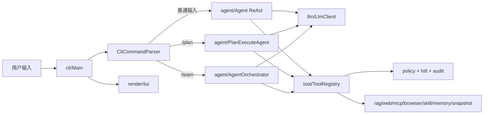

# CodeCLI 项目学习指南

这份文档把 CodeCLI 按“真实运行链路”拆成学习模块。建议先跑通本地测试，再按模块读源码；每个模块都配了入口文件、要理解的问题、可执行验证命令和一个可在 CodeCLI 里体验的案例。

## 0. 先建立整体心智模型

CodeCLI 是一个面向商业使用的 Java Agent CLI。它不是单纯的聊天壳子，而是把模型、工具、安全审批、记忆、检索、MCP、浏览器、TUI、后台任务等能力组装成一个可交互的本地 Agent 产品。

核心链路可以这样看：



学习时记住三句话：

- `Main` 是装配和命令分发中心。
- `Agent`、`PlanExecuteAgent`、`AgentOrchestrator` 是三条执行路径。
- `ToolRegistry` 是能力总线，安全层、MCP、RAG、Memory、Browser、Snapshot 都围着它接入。

## 1. 环境与首次验证

先读：

- `AGENTS.md`
- `PAI.md`
- `README.md`
- `pom.xml`

本地验证：

```powershell
mvn clean package
mvn test -Pquick
```

说明：

- `mvn clean package` 默认跳过测试，目标是快速产出 `target/CodeCLI-1.0-SNAPSHOT.jar`。
- `mvn test -Pquick` 是常规回归，会跳过部分外部进程、网络、命令超时类慢测试。
- 没有 API Key 时仍然可以先跑大量单元测试；真实 Agent 对话需要至少一个 provider 的 API Key。

启动体验：

```powershell
$env:CodeCLI_RENDERER="plain"
java -jar target/CodeCLI-1.0-SNAPSHOT.jar
```

可在 CLI 内输入：

```text
/context
/policy
/skill list
/exit
```

## 2. 模块总览

| 模块 | 包路径 | 作用 | 第一入口 |
|---|---|---|---|
| CLI 与启动装配 | `cli` | 读配置、建 renderer、启动 MCP/Skill/Task、解析斜杠命令、分发执行模式 | `Main.java` |
| ReAct 执行 | `agent` | 默认 Agent 循环，模型决定何时调工具、何时结束 | `Agent.java` |
| Plan+DAG | `agent`, `plan` | 先规划、审核，再按 DAG 依赖执行任务 | `PlanExecuteAgent.java`, `ExecutionPlan.java` |
| Multi-Agent | `agent` | Planner/Worker/Reviewer 三角色协作 | `AgentOrchestrator.java`, `SubAgent.java` |
| LLM 适配 | `llm` | 多 provider、流式输出、tool call、图片能力声明 | `LlmClient.java`, `LlmClientFactory.java` |
| Prompt 分层 | `prompt`, `resources/prompts` | 把 system prompt 拆成 Markdown 层并支持覆盖 | `PromptAssembler.java` |
| 工具系统 | `tool` | 内置工具、MCP 动态工具、并行工具执行 | `ToolRegistry.java` |
| 安全与审批 | `hitl`, `policy` | HITL、路径围栏、命令黑名单、审计日志 | `HitlToolRegistry.java`, `PathGuard.java` |
| 记忆与上下文 | `memory`, `context` | 短期记忆、长期记忆、历史压缩、上下文模式 | `MemoryManager.java`, `ContextProfile.java` |
| RAG 代码理解 | `rag` | 分块、AST 关系、SQLite 向量检索 | `CodeIndex.java`, `CodeRetriever.java` |
| Web/MCP/Browser | `web`, `mcp`, `browser` | 搜索、抓取、MCP server、Chrome DevTools、资源引用 | `McpServerManager.java`, `WebFetcher.java` |
| Skill 系统 | `skill`, `resources/skills` | 可复用专家手册，按需注入上下文 | `SkillRegistry.java` |
| 渲染与 TUI | `render`, `tui` | inline/lanterna/plain 三种渲染形态 | `RendererFactory.java`, `InlineRenderer.java` |
| LSP 诊断 | `lsp` | 写文件后做 Java 语法诊断并注入下一轮 | `LspManager.java` |
| Side-Git 快照 | `snapshot` | turn 前后快照、恢复最近 pre-turn | `SnapshotService.java`, `SideGitManager.java` |
| Runtime/后台任务 | `runtime` | SQLite 后台任务和 localhost HTTP/SSE API | `DurableTaskManager.java`, `RuntimeApiServer.java` |
| 图片输入 | `image` | `@image:`、剪贴板图片、压缩和 ContentPart | `ImageReferenceParser.java`, `ImageProcessor.java` |
| 微信通道 | `wechat` | iLink 文本通道、账号保存、消息循环、非交互策略 | `WechatCommandMain.java` |

## 3. 推荐学习路线

如果你想最快看懂主线，按这个顺序：

1. `cli/Main.java`：看程序怎么启动、命令怎么分发。
2. `tool/ToolRegistry.java`：看 Agent 真正能做什么。
3. `agent/Agent.java`：看 ReAct 如何调用 LLM 和工具。
4. `plan/ExecutionPlan.java` + `agent/PlanExecuteAgent.java`：看复杂任务如何拆解和执行。
5. `memory/MemoryManager.java` + `context/ContextProfile.java`：看上下文和记忆如何进入 prompt。
6. `prompt/PromptAssembler.java` + `src/main/resources/prompts/`：看系统提示词如何分层。
7. `hitl` + `policy` + `snapshot`：看本地 Agent 的安全网。
8. `rag` + `mcp` + `web` + `browser` + `skill`：看扩展能力。
9. `render` + `tui`：看产品化体验。
10. `runtime` + `wechat`：看无头、后台、外部入口。

### 3.1 模块原理与数据流速查

- `CLI 与启动装配`：原理是把“启动、配置、渲染、审批、模型、任务、MCP、Skill”全部装进 `Main` 这一层，避免能力彼此孤岛化。数据流是 `shell 输入 -> LineReader -> CliCommandParser -> Main 分支 -> renderer/agent/runtime`，其中普通文本进 ReAct，`/plan` 进计划链，`/team` 进多 Agent 链，未知 `/xxx` 直接在 CLI 层拦下。
- `ReAct 执行`：原理是模型自己决定下一步要不要调工具，Agent 只负责把上下文、工具定义和工具结果按协议回灌。数据流是 `user message -> memory 检索/项目记忆注入 -> prompt 组装 -> LLM stream -> tool_calls -> ToolRegistry.executeTools() -> tool result -> conversationHistory -> 下一轮 LLM`，直到模型不再发 tool call 为止。
- `工具系统`：原理是把本地能力、MCP 能力、并行执行、写文件观察、命令输出截断、代码搜索这些动作收束到一个注册表里。数据流是 `Agent/Plan/SubAgent -> ToolRegistry.executeTools() -> 单个 ToolExecutor -> policy/HITL/MCP/browser/rag`，执行结果再按原始 tool_call 顺序回灌。
- `Plan-and-Execute`：原理是先把复杂任务拆成 DAG，再按依赖关系和批次执行，适合多步骤、可验证的任务。数据流是 `user task -> Planner 输出 JSON plan -> ExecutionPlan 拓扑排序 -> PlanReviewHandler 审核 -> 批次执行 -> 每步工具调用 -> 结果汇总 -> 必要时重规划`。
- `Multi-Agent 协作`：原理是把同一任务分给 Planner、Worker、Reviewer 三种角色，让“想、做、查”分离。数据流是 `orchestrator -> planner 产出计划 -> parsePlan -> 按依赖挑可执行步骤 -> worker 执行 -> reviewer 审查 -> 不通过则重试`，同一批独立步骤可并行跑。
- `LLM Provider 适配`：原理是把不同厂商的聊天接口统一成一个 `LlmClient` 协议，流式、tool call、图片输入、上下文窗口都由能力声明控制。数据流是 `config/env -> LlmClientFactory -> 具体 provider -> chat() / stream() -> 模型响应 -> Agent/Plan/SubAgent`，切模型时只换 provider 和配置，不改上层业务。
- `Prompt 分层`：原理是把 system prompt 从 Java 硬编码拆成 Markdown 资源层，让基础规则、模式规则、审批规则、运行时信息、项目记忆、Skill 索引分层组合。数据流是 `PromptContext -> PromptAssembler -> base/personalities/modes/approvals/runtime/project/skills/context/handoff -> 最终 system prompt -> LLM`，`PAI.md` 和 `load_skill()` 都是在这条链路上注入上下文。
- `Memory 与长上下文`：原理是把“短期会话”“长期事实”“历史压缩”分成三层，避免把一次任务里的临时信息误当成长期记忆。数据流是 `用户输入/工具结果 -> ConversationMemory -> 必要时压缩 -> LongTermMemory 检索 -> buildContextForQuery() -> 注入 prompt`，`/save` 只写长期记忆，`/compact` 只压当前 ReAct 历史。
- `RAG 代码索引`：原理是先切块、再抽关系、再做 embedding、最后用 SQLite 存向量和图谱。数据流是 `/index -> CodeChunker / CodeAnalyzer -> EmbeddingClient -> VectorStore -> /search 或 code retriever -> 相关代码块 -> Agent 上下文`，`/graph` 读的是关系图，不是向量结果。
- `HITL / Policy / Audit`：原理是把危险操作显式拦下来，让用户在关键点确认，同时把每次高危动作留下可审计记录。数据流是 `tool invocation -> HitlToolRegistry -> ApprovalPolicy / PathGuard / CommandGuard -> allow/deny -> AuditLog 写 JSONL -> ToolRegistry`，用户能批准的是业务风险，不是策略层拒绝。
- `MCP / Web / Browser`：原理是把外部能力纳入统一命名空间，同时对资源、通知、浏览器登录态和网页抓取做边界管理。数据流是 `mcp.json -> McpServerManager 启动 server -> initialize -> tools/list/resources/list -> registerMcpTool / registerMcpResourceTool -> Agent 调用 mcp__* -> 资源/提示词/通知更新 -> cache 失效或重新注册`；`web_fetch` 先走 `NetworkPolicy -> WebFetcher -> HtmlExtractor`，如果页面是 SPA、登录态、或防爬墙再切到浏览器 MCP。
- `Skill 系统`：原理是把“场景经验”封装成可复用手册，让模型在匹配到任务时按需展开，而不是一直把所有经验塞进 system prompt。数据流是 `SkillRegistry 扫描 -> system prompt 注入 skill 索引 -> 模型调用 load_skill(name) -> SKILL.md 写入 SkillContextBuffer -> 下一轮 user message 前置注入`。
- `渲染与 TUI`：原理是把显示层从业务层剥离，保证同一套 Agent 能跑在 inline、lanterna、plain 三种形态里。数据流是 `Main/Agent/Planner/Orchestrator -> Renderer.stream()/updateStatus()/appendDiff() -> inline status bar / lanterna 窗口 / plain stdout`，输入、状态、工具回显都走同一个渲染通道。
- `LSP 诊断`：原理是把“改完代码后才知道错了”变成“写完立即收诊断”。数据流是 `write_file 成功 -> post-edit hook -> LspManager 跑语法诊断 -> pending diagnostics -> 下一轮 LLM 请求前合成 user message 注入`，它不阻塞主流程，只是给下一轮模型喂反馈。
- `Side-Git 快照`：原理是给每个 turn 前后做独立 side-git 记录，让 Agent 改坏了能回退而不污染用户仓库历史。数据流是 `turn 开始 -> pre-turn snapshot -> 任务执行 -> turn 结束 -> post-turn snapshot -> /restore 或 revert_turn -> 回写工作区`。
- `Runtime API / 后台任务`：原理是把 CLI 任务排队和无头 HTTP 接口做成持久化服务，方便后台跑长任务。数据流是 `POST /task or /v1/threads -> SQLite 任务/线程存储 -> worker pool 执行 -> events/status 持续写回 -> CLI 或 SSE 读取结果`。
- `图片输入`：原理是把图片当成一种 content part，而不是文本占位；支持的 provider 收图片，不支持的 provider 自动降级成文本提示。数据流是 `@image:/path or clipboard -> ImageReferenceParser/ImageProcessor -> LlmClient.Message.ContentPart -> provider 支持则发 image block，不支持则省略图片 payload 但保留上下文`。
- `微信通道`：原理是把微信 iLink 当作一个外部文本入口，并且因为没有人工审批面板，所以默认使用更保守的非交互策略。数据流是 `CodeCLI wechat setup -> 账号/工作区持久化 -> message loop 收消息 -> 进入 Agent/工具链 -> 策略拒绝高危工具 -> 回发结果给微信`。

### 3.2 模块深拆

#### CLI 与启动装配

内部结构：

- `Main` 负责初始化 `Terminal -> LineReader -> Renderer -> HitlHandler -> McpServerManager -> SkillRegistry -> Agent`。
- `CliCommandParser` 只做词法级分流，不做业务执行。
- `CodeCLICompleter`、`CodeCLIHighlighter`、`CodeCLIHistory` 是输入体验层，不参与 Agent 逻辑。

数据流：

`终端输入 -> LineReader -> 预处理(@path/@image/@resource) -> CliCommandParser ->`
`分支到 ReAct / Plan / Team / 管理命令 -> 对应执行器 -> Renderer 输出`

关键点：

- 未识别 `/xxx` 在 CLI 层直接报错，不会落给模型。
- `/clear` 只清短期和当前注入缓冲，不清长期记忆。
- `/model`、`/hitl`、`/mcp`、`/skill`、`/browser`、`/task` 都是运行态命令。

#### ReAct 执行

内部结构：

- `conversationHistory` 保存完整的 system/user/assistant/tool 消息。
- `MemoryManager` 负责短期记忆、长期记忆和上下文预算。
- `ConversationHistoryCompactor` 在接近窗口时压缩历史。
- `StreamRenderer` 负责把 reasoning 和 answer 流式写到 renderer。

数据流：

`用户输入 -> 项目记忆/长期记忆检索 -> system prompt 重建 ->`
`user message 入 history -> LLM chat(stream) ->`
`若 tool_calls: ToolRegistry 执行 -> tool result 入 history -> 再次 LLM`

关键点：

- ReAct 的核心不是“问一次答一次”，而是“模型决定是否继续循环”。
- `tool_calls` 出现时，Agent 不自己解释工具，而是把结果原样回灌给下一轮模型。
- `AgentBudget` 只做兜底，不是主逻辑。

#### ToolRegistry

内部结构：

- 内置工具按类别注册：文件、Shell、代码、RAG、Web、Browser、Memory、Skill、Snapshot。
- `mcpTools` 保存动态注册的 MCP 工具。
- `executeTools()` 是批量并行入口。
- `writeFileObserver`、`LspHook`、`AuditLog` 是执行副作用。

数据流：

`Agent/Plan/SubAgent -> executeTools(invocations) ->`
`工具名匹配 -> 参数解析 -> policy/HITL/路径检查 -> 实际执行 ->`
`结果包装 ToolExecutionResult -> 保序回灌`

关键点：

- 精确定位优先 `glob_files -> grep_code -> read_file`，RAG 只是语义补充。
- `write_file`、`execute_command`、`create_project`、`revert_turn` 走审计和审批。
- MCP 工具进入同一注册表，Agent 看起来像在调用本地工具。

#### Plan-and-Execute

内部结构：

- `Planner` 只负责产出计划 JSON。
- `ExecutionPlan` 负责任务与依赖关系。
- `PlanReviewHandler` 负责执行前确认。
- `PlanExecuteAgent` 负责把 plan 转成真实执行和汇总。

数据流：

`任务输入 -> Planner 输出 tasks/steps JSON -> ExecutionPlan 规范化 id 和依赖 ->`
`PlanReview -> 批次调度 -> 每批工具执行 -> 任务状态更新 -> 结果汇总`

关键点：

- 计划不是最终结果，只是执行蓝图。
- DAG 里无依赖的任务可以并行。
- `ESC`/取消/失败重规划都围绕 plan 的状态机展开。

#### Multi-Agent

内部结构：

- `AgentOrchestrator` 是总控。
- `SubAgent` 是统一封装的角色实例。
- `planner`、`workers`、`reviewer` 使用同一 ToolRegistry 和 MemoryManager。

数据流：

`用户任务 -> planner 生成 JSON plan -> parsePlan ->`
`按依赖找可执行 step -> worker 执行 -> reviewer 复核 ->`
`不通过则最多重试 2 次 -> 汇总输出`

关键点：

- “角色”不是多个独立产品，而是同一引擎的不同提示词和权限面。
- 并行只发生在同一依赖批次内部。
- Reviewer 的反馈会重新喂给 Worker，而不是直接改结果。

#### LLM Provider 适配

内部结构：

- `LlmClient` 统一 message、tool call、stream、能力声明。
- `AbstractOpenAiCompatibleClient` 承担大多数 OpenAI-compatible provider 的公共序列化和流式解析。
- 各 provider 子类只负责 base URL、模型名、key、能力差异。

数据流：

`配置读取 -> LlmClientFactory -> provider 实例 ->`
`chat(messages, tools, streamRenderer) -> 模型返回 -> Agent 消费`

关键点：

- provider 切换不会改上层 Agent 逻辑。
- 图片能力、tools 能力、prompt cache 都属于显式能力声明。
- `reasoning_content`、tool call 增量合并、流式结束符都是客户端协议的一部分。

#### Prompt 分层

内部结构：

- `PromptRepository` 从资源和覆盖目录读 Markdown。
- `PromptAssembler` 负责拼装顺序和变量替换。
- `PromptContext` 承载任务类型、工具开关、记忆、技能索引、外部上下文。

数据流：

`PromptContext -> 读取 base/personality/mode/approval/runtime/project/skills/context/handoff ->`
`拼成最终 system prompt -> LLM`

关键点：

- `base.md` 是地基，`mode.md` 是模式差异，`project_context` 是运行时知识。
- `PAI.md`、长期记忆、MCP resources、Skill 索引都属于“项目上下文”层。
- `load_skill()` 的效果不是直接改 prompt 文件，而是改变下一轮注入内容。

#### Memory 与长上下文

内部结构：

- `ConversationMemory` 存短期消息摘要和本轮临时上下文。
- `LongTermMemory` 存跨会话事实。
- `ContextProfile` 决定窗口、压缩阈值、RAG topK、资源索引策略。
- `TokenBudget` 管理软预算和兜底。

数据流：

`用户输入 -> 短期记忆记录 -> 相关长期记忆检索 ->`
`上下文预算判断 -> 需要时压缩 conversationHistory -> 注入下一轮 prompt`

关键点：

- 短期记忆和长期记忆不是同一回事。
- `/save` 是显式长期记忆入口。
- `/compact` 只是压当前对话，不是清空历史。

#### RAG 代码索引

内部结构：

- `CodeChunker` 把源码切成可检索块。
- `CodeAnalyzer` 用 AST 抽取类、方法、继承、调用关系。
- `EmbeddingClient` 产出向量。
- `VectorStore` 用 SQLite 存 chunk、vector、relation。
- `CodeRetriever` 统一做查询和排序。

数据流：

`/index -> 扫描源码 -> 分块 -> 关系分析 -> embedding -> SQLite 持久化 ->`
`/search -> 语义召回 -> 排序 -> 返回相关代码块`

关键点：

- RAG 是“语义召回”，不是精确定位工具。
- `grep_code` 找字符串，`search_code` 找意思。
- `/graph` 是关系视图，不是向量视图。

#### HITL / Policy / Audit

内部结构：

- `HitlToolRegistry` 是审批包裹层。
- `ApprovalPolicy` 决定哪些工具必须审批。
- `PathGuard` 和 `CommandGuard` 是策略层硬拦截。
- `AuditLog` 记录每次危险动作。

数据流：

`tool invocation -> HITL 识别危险性 ->`
`若策略拒绝则直接 deny -> 若需要审批则交互 ->`
`allow 后才进入 ToolRegistry -> 结果写 AuditLog`

关键点：

- 用户能批准的是“风险操作”，不是“越过策略层”。
- 路径和命令黑名单是在模型之外生效的。
- 审计是为了回溯，而不是只为了展示。

#### MCP / Web / Browser

内部结构：

- `McpServerManager` 管 server 生命周期、工具注册、资源缓存、通知处理。
- `McpClient` 负责 initialize、tools/list、tools/call、resources/list、resources/read。
- `StdioTransport` 和 `StreamableHttpTransport` 是两种协议承载。
- `WebFetcher` 负责静态抓取，`BrowserSession`/`BrowserGuard` 负责浏览器态。

数据流：

`mcp.json -> 启动 server -> initialize -> 拉工具/资源 ->`
`register 到 ToolRegistry -> Agent 调用 -> 通知更新 -> cache 失效`

Web/Browser 数据流：

`URL -> NetworkPolicy 检查 -> WebFetcher 抓取 -> HtmlExtractor 提正文 ->`
`若失败或页面复杂 -> Chrome DevTools MCP -> snapshot / click / input`

关键点：

- MCP 工具、资源、prompts 是三条不同通道。
- `@server:uri` 和 `mcp__server__read_resource` 是两种入口。
- 浏览器 shared/isolated 模式切换影响的是会话态和审批面。

#### Skill 系统

内部结构：

- `SkillRegistry` 负责三层目录扫描和 disabled 过滤。
- `SkillStateStore` 只持久化禁用列表。
- `SkillBuiltinExtractor` 负责内置 skill 的落盘与缓存。
- `SkillContextBuffer` 负责下一轮注入。

数据流：

`启动扫描 skill -> system prompt 注入 skill 索引 ->`
`模型看到匹配任务 -> 调用 load_skill(name) ->`
`SKILL.md 进入 buffer -> 下一轮 user message 前置注入`

关键点：

- Skill 是“按需展开的操作手册”，不是常驻 prompt。
- `references/` 和 `scripts/` 只有在 skill 被触发后才有意义。
- buffer 是一次性消费，避免上下文常驻膨胀。

#### 渲染与 TUI

内部结构：

- `Renderer` 是统一抽象。
- `InlineRenderer` 是默认主路径。
- `BottomStatusBar`、`BlockRegistry`、`InlineActivityDisplay` 是 inline 的局部组件。
- `LanternaRenderer` 是全屏 fallback。

数据流：

`业务层输出 -> Renderer.stream()/updateStatus()/appendDiff() ->`
`inline 状态栏 / lanterna 窗口 / plain stdout`

关键点：

- 输出不应绕过 Renderer 直接打印。
- 状态栏显示的是“当前运行态”，不是聊天正文。
- inline 的折叠块和 diff 是围绕工具事件生成的。

#### LSP 诊断与 Side-Git 快照

内部结构：

- `LspManager` 负责诊断调度。
- `LspDiagnosticFormatter` 负责把诊断变成可注入文本。
- `SideGitManager` 负责独立快照仓库。
- `SnapshotService` 负责 turn 粒度操作。

数据流：

`write_file 成功 -> LSP 诊断 -> pending diagnostics ->`
`下轮 prompt 注入 -> 若改坏则 /restore 或 revert_turn -> side-git 回写`

关键点：

- 诊断和快照都不是主流程阻塞点。
- 诊断是“下一轮输入”，快照是“可恢复状态”。
- `revert_turn` 是受控回滚，不是随手覆写。

#### Runtime API / 后台任务

内部结构：

- `DurableTaskManager` 管 SQLite 任务队列和 worker pool。
- `RuntimeThreadStore` 管 thread/event 持久化。
- `RuntimeApiServer` 暴露本地 HTTP/SSE。

数据流：

`/task add 或 /v1/threads -> 入库 -> worker 执行 ->`
`状态/事件写库 -> CLI / SSE / /task log 读取`

关键点：

- `running` 任务在重启后会恢复为 `enqueued`。
- API 只监听本地，不是公网服务。
- 这套链路的目标是“可离线托管长任务”。

#### 图片输入

内部结构：

- `ImageReferenceParser` 识别 `@image:` 引用。
- `ImageProcessor` 负责缩放、压缩、铺白底。
- `ClipboardImage` 负责剪贴板图像。
- `AbstractOpenAiCompatibleClient` 把图片 part 序列化到 provider 需要的格式。

数据流：

`本地图片/剪贴板 -> 解析 -> 预处理 -> ContentPart ->`
`支持图片的 provider 发送真实图像块 -> 不支持的 provider 降级为文本提示`

关键点：

- 图片不是 OCR 文本替代品。
- 历史图片会被压成占位，避免重复烧上下文。
- 图片输入和模型能力声明是绑定的。

#### 微信通道

内部结构：

- `WechatCommandMain` 是进程入口。
- `WechatMessageLoop` 负责消息循环。
- `WechatPolicyDecider` 决定通道下的允许/拒绝。
- `WechatAccountStore` 负责账号持久化。

数据流：

`wechat setup -> 绑定账号/工作区 -> message loop 收消息 ->`
`转成 Agent 输入 -> 工具/策略执行 -> 结果回发微信`

关键点：

- 微信通道不是另一个 Agent，只是另一个输入输出入口。
- 因为没有交互审批界面，所以默认更保守。
- 外部通道的安全面和 CLI 不完全相同。

### 3.3 按 README 演进历程的面试讲法

这一节按 README 的“演进历程”来讲。适合面试时从产品演化和架构设计角度介绍项目，而不是从包结构背源码。

#### 第一期：ReAct Agent CLI

大致原理：

- 核心思想是让模型进入一个“思考 -> 选择工具 -> 读取结果 -> 继续思考”的循环。
- Agent 本身不预先写死流程，而是把工具定义暴露给模型，由模型在每一轮决定下一步动作。

为什么这样设计：

- 这样能先把最小可用 Agent 跑起来。
- 对简单任务来说，ReAct 比工作流编排更灵活，开发成本也更低。
- 后面做 Plan、Multi-Agent、MCP，本质上都可以复用这一层工具和消息协议。

面试时可以这样说：

- “我这个项目最开始是一个标准 ReAct Agent。设计上我没有先上复杂工作流，而是先把工具调用闭环做通：用户输入进来后，模型决定是否调用 `read_file`、`grep_code`、`execute_command` 这类工具，工具结果再回灌给下一轮模型。这样做的好处是简单任务非常灵活，而且为后面的计划执行、多 Agent、MCP 扩展打下了统一底座。”
- “我会先保证模型能‘想-做-看结果-再想’地跑起来，再去考虑更复杂的编排。这样一来，产品最早期就能有真实可用的能力，而不是只停留在概念设计。”
- “从架构上看，这一层最重要的是统一消息协议和工具协议，后面所有能力扩展都不会推翻它。”

#### 第二期：Plan-and-Execute + DAG

大致原理：

- 在 ReAct 之上增加一个“先规划、后执行”的层。
- 规划结果不是自然语言文本，而是结构化任务列表和依赖关系，也就是一个 DAG。

为什么这样设计：

- 纯 ReAct 在多步骤任务里容易边做边改主意，稳定性不够。
- 先规划能把任务拆细，按依赖批次执行，还能在执行前让用户审核，风险更低。

面试时可以这样说：

- “第二阶段我把 Agent 从即兴执行升级成了计划执行。核心做法是让 Planner 先产出结构化 JSON 计划，再把任务装进 `ExecutionPlan` 里做拓扑排序。这样复杂任务不会一上来就盲做，而是先拆成可验证的小步骤；同时我保留了用户审核入口，保证计划可解释、可取消、可重规划。”
- “我想表达的是：复杂任务不是不能做，而是要先把‘做什么、先做什么、依赖什么’显式化。DAG 能把执行顺序和依赖边界说清楚，后面再出错也知道是哪个环节出了问题。”
- “这个阶段的重点不是替代 ReAct，而是给 ReAct 补一个更适合多步骤任务的外壳。”

#### 第三期：Memory + 上下文工程

大致原理：

- 把记忆拆成三层：当前轮次的短期记忆、跨会话的长期记忆、项目级规则记忆。
- 再配一层上下文压缩逻辑，防止 conversation history 无限膨胀。

为什么这样设计：

- 很多 Agent 项目会把所有历史都堆进 prompt，短期看能跑，长对话就会崩。
- 我这里把“用户临时说的话”和“跨会话稳定事实”明确分开，减少污染。

面试时可以这样说：

- “这部分我重点做的是上下文分层。短期记忆只服务当前任务，长期记忆只保存显式确认的稳定事实，比如 `/save` 保存的偏好；项目级规则则通过 `PAI.md` 注入。这样模型不会把一轮临时对话误当成长期知识，同时在接近窗口上限时还能自动压缩历史，保证长对话可持续。”
- “我不希望记忆系统只是‘存历史’，而是要区分‘临时上下文’和‘稳定知识’。这样做以后，模型更不会被噪声带偏，长期行为也更可控。”
- “面试里我会强调这是一种上下文工程，而不只是记忆存储。”

#### 第四期：RAG 检索 + 代码库理解

大致原理：

- 把代码切成可检索块，抽取类和方法之间的关系，再做 embedding 和 SQLite 持久化。
- 查询时用语义检索找“相关代码”，而不是只靠字符串匹配。

为什么这样设计：

- `grep_code` 适合精确找符号，但对“用户登录流程在哪”“快照是怎么做的”这种自然语言问题不够友好。
- RAG 让 Agent 能从“找字符串”提升到“理解代码库结构”。

面试时可以这样说：

- “我把代码理解分成两条链路：精确定位还是走 `grep_code/read_file`，语义理解走 RAG。实现上我会先做代码分块，再通过 AST 抽关系，最后把向量和图谱都落到 SQLite。这样 Agent 既能回答‘某个类在哪’，也能回答‘某个能力整体是怎么串起来的’。”
- “我会把精确检索和语义检索明确分工，因为它们解决的问题不同：前者适合找符号，后者适合理解整体结构。”
- “如果面试官追问实现，我会强调：先分块，再建索引，再做语义召回，最后把结果格式化成模型更容易消费的上下文。”

#### 第五期：Multi-Agent 协作 + 角色分工

大致原理：

- 用 Planner、Worker、Reviewer 三个角色，把复杂任务拆成‘想、做、查’三个责任面。
- 顶层由 Orchestrator 统一调度，底层仍复用同一套 ToolRegistry。

为什么这样设计：

- 单 Agent 在复杂任务里容易把规划、执行、审查混在一起，质量不稳定。
- 角色分工后，每个子代理的 prompt 更聚焦，可解释性也更强。

面试时可以这样说：

- “Multi-Agent 不是为了堆概念，而是为了解耦职责。我让 Planner 只负责拆任务，Worker 只负责执行，Reviewer 只负责验收；Orchestrator 再按依赖关系调度它们。这样每个角色的目标更单一，输出质量更稳定，而且 Reviewer 不通过时还能把反馈重新喂回 Worker，形成闭环。”
- “这部分我想解决的是‘一个模型同时想规划、执行、验收，容易角色混乱’的问题。拆开之后，每个角色的 prompt 更短，行为也更容易稳定。”
- “从面试表达上，我会说这是把复杂任务做成了一个小型协作系统，而不是单个大 prompt。”

#### 第六期：Human-in-the-Loop + 审批流

大致原理：

- 把高风险工具调用从普通工具里分出来，进入审批链。
- 审批决策支持批准、全部放行、拒绝、跳过、修改参数后执行。

为什么这样设计：

- 本地 Agent 最危险的不是“答错话”，而是“写错文件”和“执行错命令”。
- 如果没有审批，模型一旦误判，破坏面很大。

面试时可以这样说：

- “我把安全控制的第一层设计成 HITL。比如 `write_file`、`execute_command`、`revert_turn` 这些工具在执行前会先被识别成危险操作，再交给用户审批。这样不是简单禁止模型做事，而是在高风险点把最终决定权交还给人。”
- “我会强调 HITL 不是削弱 Agent，而是给 Agent 增加一个真人校验阀门。低风险动作让模型自己跑，高风险动作让人确认。”
- “这个设计的价值在于它更适合真实生产环境，而不是只适合 demo。”

#### 第六期增强：路径围栏 / 命令快速拒绝 / 审计

大致原理：

- 在 HITL 之外，再加一层不可绕过的策略层。
- 核心包括 `PathGuard`、`CommandGuard` 和 `AuditLog`。

为什么这样设计：

- 仅靠用户审批还不够，因为有些请求根本不该被批准。
- 比如越过项目根目录、执行明显破坏性的命令，这种应当直接拒绝。

面试时可以这样说：

- “我后面又补了一层 Policy。思路是把安全分成两层：HITL 解决‘能不能做’，Policy 解决‘压根不允许做’。路径越界、危险命令黑名单会在审批前直接挡掉，同时所有高风险操作都会写审计日志，方便事后追溯。”
- “这层的目的不是再做一次审批，而是加硬约束。面试时我会说，用户可以批准风险操作，但不能批准策略层明令禁止的操作。”
- “这样做后，系统的安全边界就从‘人来把关’升级成了‘人把关 + 机器硬拒绝’。”

#### 第七期：异步执行 + 并行工具调用

大致原理：

- 同一轮返回多个 `tool_calls` 时并行执行。
- Plan 和 Multi-Agent 里无依赖的任务批次也可以并行跑。

为什么这样设计：

- 很多工具调用天然独立，比如同时读多个文件、并发做多个查询。
- 如果全部串行，等待时间会明显放大。

面试时可以这样说：

- “这一期我做的是执行效率优化。核心不是简单开线程，而是把并行收敛到统一的 `executeTools()` 入口里，同时保证结果按原始 `tool_call` 顺序回灌。这样既提升了吞吐，又不会把消息协议搞乱；同样的能力也被复用到了 Plan 和 Multi-Agent 的批次调度里。”
- “我会强调并行不是无脑并行，而是基于独立性的并行。只有没有依赖的工具和任务才并发跑，这样效率提升和结果确定性才能兼得。”
- “这类优化很适合面试时讲成工程取舍：既要快，也要保持可控和可复现。”

#### 第八期：多模型适配 + 运行时切换

大致原理：

- 把不同模型厂商统一抽象成 `LlmClient` 接口。
- 对 OpenAI-compatible 厂商复用同一个抽象基类。

为什么这样设计：

- Agent 的上层不应该关心底层是 GLM、DeepSeek 还是 Kimi。
- 只要 tools、stream、message 协议统一，上层逻辑就能保持稳定。

面试时可以这样说：

- “我把模型层单独抽象成 `LlmClient`，包括消息协议、流式输出、tool call、上下文能力声明。这样上层 Agent 不依赖具体厂商；新增 provider 时，大多数场景只要补一个瘦客户端和工厂配置，不需要改业务逻辑。”
- “这个设计的重点是把厂商差异关在最底层，避免业务层到处写 if-else。”
- “面试时我会说，这样切换模型不会牵动上层 Agent、Prompt 或工具链，平台稳定性更高。”

#### 第九期：联网能力 + Web 工具

大致原理：

- 增加 `web_search` 和 `web_fetch` 两条链路。
- 搜索解决‘找来源’，抓取解决‘拿正文’。

为什么这样设计：

- 实时信息问题不能靠模型参数记忆。
- 但联网也不能无边界，所以要配网络策略、限流和正文提取。

面试时可以这样说：

- “联网部分我没有直接接浏览器，而是先做了两层轻量能力：`web_search` 负责检索候选来源，`web_fetch` 负责抓正文和抽取 Markdown。这样大部分公开网页都能低成本处理；只有 SPA、登录态或防爬页面，才升级到浏览器 MCP。”
- “我会把它讲成‘先轻后重’的策略：先用成本最低的路径解决大多数问题，真遇到复杂页面再升级。”
- “这样既能保证响应速度，也能避免浏览器能力一上来就变成系统默认成本。”

#### 第十期：MCP 协议核心

大致原理：

- 把外部 server 的能力通过 MCP 协议接入，统一注册成 `mcp__{server}__{tool}`。
- 既支持本地 stdio server，也支持远程 Streamable HTTP server。

为什么这样设计：

- 内置工具数量有限，Agent 真正扩展性来自可插拔工具生态。
- MCP 能把“外部能力”纳入统一工具模型，而不是给 Agent 开很多特例。

面试时可以这样说：

- “我把 MCP 当成项目的外部能力总线。启动时会读取用户级和项目级 `mcp.json`，完成初始化握手，然后把外部工具动态注册进 ToolRegistry。对上层 Agent 来说，它调用的是统一工具；对底层来说，既可以是本地子进程，也可以是远程 HTTP server。”
- “这样我就把扩展能力从‘写死在主程序里’变成了‘可插拔注册’，后续接新 server 的成本会低很多。”
- “面试时我会强调 MCP 的价值不只是接工具，而是把外部生态纳入同一套权限和消息模型。”

#### 第十二期：长上下文工程

大致原理：

- 根据模型窗口大小动态切换 short、balanced、long 三种上下文模式。
- 同时把 prompt cache、RAG topK、资源索引策略一起联动。

为什么这样设计：

- 200k 和 1M 窗口模型的最佳策略完全不同。
- 不能拿短上下文时代的压缩思路直接套到长上下文模型上。

面试时可以这样说：

- “我没有把上下文窗口写死，而是做成按模型能力自适应。窗口小时优先压缩和精排，窗口大时就放宽摘要、提高 RAG topK，并把 MCP resource 索引也纳入 prompt。这样同一套 Agent 能适配从 128k 到 1M 的不同模型，而不是一套策略硬跑到底。”
- “这部分我会讲成成本控制：不是窗口越大越无脑塞，而是要按模型特点动态取舍。”
- “面试官如果继续追问，我会说这是把 token 管理和检索策略一起做成了自适应系统。”

#### 第十三期：Chrome DevTools MCP

大致原理：

- 对需要 DOM、点击、表单、动态页面的场景，接入浏览器 MCP。
- 浏览器工具不是替代 `web_fetch`，而是作为失败后的升级路径。

为什么这样设计：

- 如果一开始就用浏览器，成本高、速度慢、风险大。
- 但对微信公众号、知乎、小红书、登录态系统这类页面，静态抓取往往不够。

面试时可以这样说：

- “这期我把网页处理做成分层策略：先 `web_fetch`，拿不到再升级到 Chrome DevTools MCP。这样静态页面走轻链路，动态页面走重链路，成本和覆盖面能平衡住。同时浏览器能力是通过 MCP 接进来的，所以没有破坏原本的工具抽象。”
- “我通常会把它描述成‘静态优先、动态兜底’的浏览链路。”
- “这样既不牺牲普通网页的效率，也给复杂页面留了足够的上限。”

#### 第十四期：CDP 会话复用 + 登录态访问

大致原理：

- 支持从 isolated 浏览器模式切到 shared 模式，复用用户现有登录态 Chrome。
- 通过 `/browser connect` 或内部 browser 工具切换。

为什么这样设计：

- 真正有业务价值的很多页面都依赖登录态。
- 但复用登录态会提高风险，所以必须把模式切换和审批面一起设计。

面试时可以这样说：

- “为了支持登录态系统，我没有直接把真实浏览器默认暴露给 Agent，而是分成 isolated 和 shared 两种模式。默认是隔离 profile，只有在确实需要登录态时才切到 shared，并且切换后会清空旧的放行状态，避免信任跨模式延续。”
- “面试里我会特别强调：登录态不是默认能力，而是高权限能力，所以一定要有模式切换和状态隔离。”
- “这也是为什么我没有把浏览器当成普通工具，而是把它当成一个受控的协作入口。”

#### 第十五期：Skill 系统

大致原理：

- 把场景化经验从 system prompt 里抽出来，做成可按需加载的 `SKILL.md`。
- 平时只注入 skill 索引，需要时再加载正文。

为什么这样设计：

- 工具一多，单靠 system prompt 很难把“什么时候用什么工具”讲清楚。
- Skill 本质上是给模型准备的领域操作手册。

面试时可以这样说：

- “Skill 系统的出发点是把经验工程化。比如网页阅读这件事，不是光有工具就够了，还需要告诉模型什么场景先 `web_fetch`、什么场景直接上浏览器。我把这些经验整理成 skill，启动时只注入索引，命中任务时再用 `load_skill` 把正文动态注入，兼顾效果和上下文成本。”
- “我会把 Skill 讲成‘轻索引 + 重正文’的两段式设计。这样模型先知道能力边界，真正需要时再读取完整方法论。”
- “它本质上是把场景经验做成可复用知识包，而不是把所有经验一次性塞进 prompt。”

#### 第十六期：TUI 产品化

大致原理：

- 把交互层抽象成 `Renderer`，支持 inline、lanterna、plain 三种形态。
- 所有业务输出统一走 renderer，而不是业务层自己打印。

为什么这样设计：

- 如果不抽象渲染层，Agent、Planner、MCP、索引进度都会各写各的 stdout，很快失控。
- 渲染抽象后，产品体验和业务能力就能分层演进。

面试时可以这样说：

- “TUI 这部分我重点做的是渲染层解耦。我把所有输出统一收口到 `Renderer` 接口，再提供 inline、lanterna 和 plain 三个实现。这样同一套 Agent 能在不同终端形态里复用，而且状态栏、折叠工具块、行内 diff 这些体验能力也不会反向污染业务逻辑。”
- “我会把它描述成‘业务层不关心显示形态，显示层自己决定怎么画’。”
- “这样以后即使换终端库，核心 Agent 和工具链也不用跟着重写。”

#### 第十七期：LSP 诊断注入

大致原理：

- 写文件后立刻触发一次轻量诊断，把结果注入到下一轮模型上下文。
- 本质上是给 Agent 加“写后反馈”。

为什么这样设计：

- 很多 Agent 改完代码后，并不知道自己引入了语法错误。
- 如果等用户手工编译才发现，回路太长。

面试时可以这样说：

- “这一期我给 Agent 补了一个 post-edit feedback 机制。`write_file` 成功后会触发 Java 语法诊断，诊断结果不会阻塞工具执行，但会作为下一轮模型输入的一部分。这样 Agent 改完代码后能立刻看到自己引入的问题，而不是等人去提醒。”
- “我会把它讲成‘写后即时反馈’，本质上是缩短模型和编译器之间的反馈回路。”
- “这类能力很适合强调工程闭环，而不只是功能堆叠。”

#### 第十八期：Git Side-History 快照与回滚

大致原理：

- 在用户项目 `.git` 之外，单独维护一个 side-git 仓库做 turn 级快照。
- 支持查看最近快照和恢复到某个 pre-turn 状态。

为什么这样设计：

- 直接改用户 `.git` 历史会过于侵入。
- 但完全没有回滚能力，Agent 改坏文件时代价很高。

面试时可以这样说：

- “我没有把回滚建立在用户自己的 git 历史上，而是单独做了一个 side-git。每个 turn 前后各做一次快照，出问题时可以恢复到最近的 pre-turn。这样既给 Agent 提供了可逆性，又不会污染用户仓库的正常提交历史。”
- “面试时我会说，这是给 Agent 加了‘可撤销编辑’能力，但不碰用户原仓库的主历史。”
- “这样既能兜底风险，又能保留用户对自己代码历史的完整控制权。”

#### 第十九期：Prompt 分层架构

大致原理：

- 把系统提示词拆成 base、mode、approval、runtime、project context、skills 等多个层。
- 最终由 `PromptAssembler` 统一组装。

为什么这样设计：

- Prompt 一旦全部写在 Java 里，后续维护和调优会非常痛苦。
- 分层后，每一类规则都有自己的归属，覆盖和调试也更清晰。

面试时可以这样说：

- “这期我做的是 prompt 的工程化重构。原来 prompt 是散在 Java 代码里的，后面我把它拆成多层 Markdown 资源，再通过 `PromptAssembler` 统一拼装。这样一来，模式差异、审批策略、项目记忆、Skill 索引都可以独立维护，不需要每次都改代码重编译。”
- “这部分我会讲成‘把 prompt 当配置，而不是当代码硬编码’。”
- “这样调优和做实验的效率会高很多，而且不同模式之间的差异也更清晰。”

#### 第二十期：异步后台任务 + Runtime API

大致原理：

- 把长任务从前台 CLI 里拆出来，放进持久化队列。
- 同时暴露本地 HTTP/SSE Runtime API，支持无头调用。

为什么这样设计：

- 终端前台模式不适合跑耗时很久的任务。
- 一旦要对接 IDE、脚本、外部系统，就需要稳定 API 而不是人工交互。

面试时可以这样说：

- “这一期我把 Agent 从纯交互工具往平台化能力推了一步。内部用 `DurableTaskManager` 做 SQLite 持久化队列，支持任务状态恢复；外部再暴露本地 Runtime API，让外部系统可以通过 thread 和 event 的方式调用它。这样 CodeCLI 不只是一个终端工具，也能作为本地 Agent Runtime 使用。”
- “我会强调这里做的是‘前台交互’和‘后台执行’的分离。”
- “这样一来，长任务不必一直占着终端，外部脚本也能稳定接入。”

#### 第二十一期：图片复制粘贴输入

大致原理：

- 把图片当成 `ContentPart` 进入消息协议，而不是先 OCR 成文本。
- provider 支持图片时发真实图片块，不支持时自动降级。

为什么这样设计：

- 很多视觉任务并不是“把图转成字”就能解决。
- 统一成 content part 后，图片输入和文字输入可以走同一条消息链路。

面试时可以这样说：

- “图片能力这一期我做的是协议级扩展，而不是外挂功能。我把消息结构升级成支持 text 和 image 的 content parts，这样浏览器截图、剪贴板图片、本地 `@image:` 都能走同一条输入链路。支持多模态的模型会收到真实图片，不支持的模型则自动退化成文本提示。”
- “我会把它讲成‘输入协议升级’，而不是只加了一个截图小功能。”
- “这样以后无论图片来自剪贴板、文件还是浏览器，处理路径都是一致的。”

#### 第二十三期：微信 iLink 通道

大致原理：

- 给 CodeCLI 增加一个微信文本入口，但安全策略独立于 CLI。
- 微信消息通过 iLink 长轮询进入 Agent，再把结果回传。

为什么这样设计：

- 终端入口适合开发者自己用，微信入口适合把 Agent 带到移动场景或轻协作场景里。
- 但微信没有本地审批面板，所以能力必须做收缩。

面试时可以这样说：

- “微信通道本质上是给 CodeCLI 加了一个新的外部入口。我没有重做一套 Agent，而是把微信消息转换成同样的任务输入，再复用原有工具链和记忆链路。区别在于安全模型更保守，比如 `execute_command` 和部分 MCP 能力默认拒绝，因为微信端没有可视化审批面板。”
- “我会把它解释成‘同一套能力，换一个入口’，而不是重新造一个微信 Agent。”
- “因为入口变了，风险承受方式也要变，所以安全策略必须比 CLI 更保守。”

#### 总结讲法

如果面试官让你整体概括，可以这样收口：

- “这个项目不是一次性堆出来的，而是按能力层逐步演进的。第一层先把 ReAct 和工具调用跑通；第二层补计划执行、记忆、RAG、多 Agent，让它更聪明；第三层补 HITL、Policy、快照、LSP，让它更安全；第四层再接 MCP、Browser、Skill、Runtime API、微信通道，让它更开放、更产品化。我的设计主线一直是同一个：上层 Agent 负责决策，中层 ToolRegistry 负责能力收口，底层再通过 Prompt、Memory、Policy、MCP、Renderer 把体验和安全性补齐。”


如果面试官想听得更完整，可以按这个结构答：

1. 先讲产品定位
   - “CodeCLI 是一个面向商业使用的 Java Agent CLI，对标 Claude Code，不是 demo 级聊天框，而是可落地的本地 Agent 工作台。”
   - “所以我在设计时优先考虑的不是单轮问答，而是长会话、工具调用、安全控制、可恢复、可审计和可扩展。”

2. 再讲核心架构
   - “主链路其实很清楚：CLI 负责接入，Agent 负责决策，ToolRegistry 负责能力，PromptAssembler 负责系统提示词拼装，Memory 负责上下文，Policy/HITL 负责安全，Renderer 负责交互体验。”
   - “这个分层让我后续加 MCP、Skill、Browser、Runtime API 时，不需要推翻主结构，只要接到对应层上。”

3. 再讲演进节奏
   - “前期先做 ReAct，让模型能自己决定什么时候调工具。”
   - “然后加入 Plan/DAG，把复杂任务拆成可执行步骤。”
   - “再加 Memory/RAG，让它能记住稳定事实、检索代码库。”
   - “之后做 Multi-Agent 和 HITL，把分工、审核和风险控制补上。”
   - “最后补 MCP、Skill、Browser、Runtime API、微信通道，让它从单机 CLI 变成一个可扩展平台。”

4. 最后讲取舍
   - “我没有把所有意图都做成本地分类器，而是让大部分自然语言意图交给模型判断；本地只保留 slash 命令、简单规划和少量安全规则。”
   - “这样做的好处是扩展快、语义更自然；代价是更依赖 prompt 设计和工具边界，所以要配合 HITL、Audit 和上下文压缩。”

面试官常问的追问，可以提前准备这几类：

- “为什么要做 Plan + ReAct 双模式，而不是只保留一种？”
- “ToolRegistry 为什么要统一注册内置工具和 MCP 工具？”
- “Skill 为什么不直接全量塞进 prompt？”
- “为什么要有 HITL，而不是完全相信模型？”
- “上下文太长、工具太多时怎么控成本和控风险？”
- “如果让你重构 Main，你会拆成哪些模块？”

回答时尽量遵守一个顺序：

- 先说目标是什么
- 再说怎么做
- 然后说为什么这么做
- 最后说有什么边界和代价

如果想把回答说得更像“有实战经验”，可以补一句：

- “我会优先保住主链路稳定，再逐步把能力外扩，所以每次新增模块都尽量保持对 Agent 主流程的侵入最小。”
## 4. 模块学习与实操

### 模块 A：CLI 启动与命令解析

读源码：

- `src/main/java/com/CodeCLI/cli/Main.java`
- `src/main/java/com/CodeCLI/cli/CliCommandParser.java`
- `src/main/java/com/CodeCLI/cli/CodeCLICompleter.java`
- `src/main/java/com/CodeCLI/cli/CodeCLIHighlighter.java`

要理解：

- `Main` 如何创建 `LlmClient`、`HitlToolRegistry`、`McpServerManager`、`SkillRegistry`、`Renderer`、`Agent`。
- 斜杠命令如何在 CLI 层被消费，未知 `/xxx` 为什么不会回退给 Agent。
- 普通文本什么时候进入 ReAct，`/plan` 和 `/team` 如何切到另外两条路径。

验证：

```powershell
mvn test -Dtest=CliCommandParserTest,MainInputNormalizationTest,CodeCLICompleterTest,CodeCLIHighlighterTest -DskipTests=false
```

手工案例：

```text
/unknown
/context
/model
/exit
```

观察点：`/unknown` 应直接提示未知命令；不会被当作普通提问交给模型。

### 模块 B：ReAct 默认执行路径

读源码：

- `src/main/java/com/CodeCLI/agent/Agent.java`
- `src/main/java/com/CodeCLI/agent/AgentBudget.java`
- `src/main/resources/prompts/modes/agent.md`

要理解：

- `conversationHistory` 如何维护 system/user/assistant/tool 消息。
- LLM 返回 `tool_calls` 时，如何通过 `ToolRegistry.executeTools()` 执行并把结果回灌。
- 没有 tool call 时，为什么本轮结束。
- `AgentBudget` 如何防止死循环或过多轮次。

验证：

```powershell
mvn test -Dtest=AgentBudgetTest,AgentClearHistoryTest,AgentStreamRendererTest,AgentWebSearchDecisionTest -DskipTests=false
```

真实案例：

```text
请找出 CliCommandParser 里 /memory search 是怎么解析的，并给出关键类名
```

期望观察：Agent 应优先用本地代码工具定位，而不是联网搜索。

### 模块 C：工具注册、工具执行与代码搜索

读源码：

- `src/main/java/com/CodeCLI/tool/ToolRegistry.java`
- `src/main/java/com/CodeCLI/tool/RipgrepCodeSearchEngine.java`
- `src/main/java/com/CodeCLI/tool/JavaCodeSearchEngine.java`
- `docs/code-search-golden-set.md`

要理解：

- 内置工具在哪里注册：文件、Shell、代码、RAG、Web、Browser、Memory、Skill、Snapshot。
- `grep_code` 优先 ripgrep，失败时回退 Java 扫描。
- `read_file` 支持 `offset/limit`，避免整份大文件塞进上下文。
- 同一轮多个工具调用会并行执行，但结果顺序保持 tool_call 原顺序。

验证：

```powershell
mvn test -Dtest=CodeSearchGoldenSetTest,ToolRegistryTest -DskipTests=false
```

真实案例：

```text
帮我定位 ToolRegistry 中注册 load_skill 工具的代码，并解释它和 SkillContextBuffer 的关系
```

观察点：应能看到 `load_skill` 把 `SKILL.md` 正文写入 buffer，下轮 user message 前置注入。

### 模块 D：Plan-and-Execute 与 DAG

读源码：

- `src/main/java/com/CodeCLI/agent/PlanExecuteAgent.java`
- `src/main/java/com/CodeCLI/plan/Planner.java`
- `src/main/java/com/CodeCLI/plan/ExecutionPlan.java`
- `src/main/java/com/CodeCLI/plan/Task.java`
- `src/main/java/com/CodeCLI/cli/PlanReviewInputParser.java`

要理解：

- Planner 如何要求 LLM 输出 JSON 计划。
- `ExecutionPlan` 如何拓扑排序、找可执行任务、按批次并行。
- 计划审阅交互中 Enter、Ctrl+O、ESC、I 分别做什么。
- 失败后如何重规划或返回失败。

验证：

```powershell
mvn test -Dtest=ExecutionPlanTest,PlannerTest,PlanExecuteAgentTest,PlanReviewInputParserTest -DskipTests=false
```

真实案例：

```text
/plan 梳理 prompt 模块的职责，读取相关文件，然后给我画出 prompt 组装顺序
```

观察点：先出现计划摘要或完整计划，确认后再执行。

### 模块 E：Multi-Agent 协作

读源码：

- `src/main/java/com/CodeCLI/agent/AgentOrchestrator.java`
- `src/main/java/com/CodeCLI/agent/SubAgent.java`
- `src/main/java/com/CodeCLI/agent/AgentRole.java`
- `src/main/resources/prompts/modes/team-planner.md`
- `src/main/resources/prompts/modes/team-worker.md`
- `src/main/resources/prompts/modes/team-reviewer.md`

要理解：

- Planner 只负责拆计划，Worker 负责执行，Reviewer 负责检查。
- 同一批无依赖步骤如何并行派给 Worker。
- Reviewer 未通过时为什么最多重试 2 次。

验证：

```powershell
mvn test -Dtest=AgentRoleTest,AgentMessageTest,AgentOrchestratorTest,SubAgentTest -DskipTests=false
```

真实案例：

```text
/team 分别检查 cli、tool、memory 三个模块的测试覆盖情况，并汇总学习建议
```

观察点：输出应分规划、执行、汇总阶段。

### 模块 F：LLM Provider 与模型切换

读源码：

- `src/main/java/com/CodeCLI/llm/LlmClient.java`
- `src/main/java/com/CodeCLI/llm/LlmClientFactory.java`
- `src/main/java/com/CodeCLI/llm/AbstractOpenAiCompatibleClient.java`
- `src/main/java/com/CodeCLI/llm/GLMClient.java`
- `src/main/java/com/CodeCLI/llm/DeepSeekClient.java`
- `src/main/java/com/CodeCLI/llm/KimiClient.java`
- `src/main/java/com/CodeCLI/llm/StepClient.java`
- `src/main/java/com/CodeCLI/llm/XfyunMaaSClient.java`
- `src/main/java/com/CodeCLI/llm/AgnesClient.java`

要理解：

- `LlmClient` 把 message、tool、tool call、stream handler 抽成统一接口。
- OpenAI-compatible provider 复用 `AbstractOpenAiCompatibleClient`。
- 不同 provider 如何声明 context window、prompt cache、图片输入、tools 支持。
- `/model` 和 `/config provider ...` 如何影响当前 provider。

验证：

```powershell
mvn test -Dtest=LlmClientFactoryTest,AbstractOpenAiCompatibleClientImageInputTest,ContextProfileTest -DskipTests=false
```

真实案例：

```text
/model agnes
/context
```

观察点：模型名、provider、context window 应随切换变化。需要先配置对应 API Key。

### 模块 G：Prompt 分层与项目记忆

读源码：

- `src/main/java/com/CodeCLI/prompt/PromptAssembler.java`
- `src/main/java/com/CodeCLI/prompt/PromptRepository.java`
- `src/main/java/com/CodeCLI/prompt/ProjectMemoryLoader.java`
- `src/main/resources/prompts/base.md`
- `src/main/resources/prompts/context/context-management.md`
- `PAI.md`

要理解：

- Prompt 组装顺序：base -> personality -> mode -> approval -> runtime_context -> project_context -> skills -> context_mgmt -> handoff。
- `runtime_context` 每轮注入当前日期和时区。
- `PAI.md` 是项目级 system prompt 记忆，不等于 `/save` 长期记忆。
- 用户级和项目级 prompt 覆盖是整文件替换。

验证：

```powershell
mvn test -Dtest=PromptAssemblerTest,ProjectMemoryLoaderTest -DskipTests=false
```

真实案例：

```text
/export
```

观察点：导出的 Markdown 会包含完整 system prompt，适合检查模型实际收到的指令。

### 模块 H：Memory 与长上下文

读源码：

- `src/main/java/com/CodeCLI/memory/MemoryManager.java`
- `src/main/java/com/CodeCLI/memory/ConversationMemory.java`
- `src/main/java/com/CodeCLI/memory/LongTermMemory.java`
- `src/main/java/com/CodeCLI/memory/ConversationHistoryCompactor.java`
- `src/main/java/com/CodeCLI/context/ContextProfile.java`
- `src/main/java/com/CodeCLI/memory/TokenBudget.java`

要理解：

- 短期记忆、长期记忆、conversation history 压缩是三件不同的事。
- `/save` 保存长期稳定事实，默认项目级作用域。
- `/compact` 压缩当前 ReAct 历史，不清空长期记忆。
- 长上下文模式下会调整压缩、RAG topK、MCP resource 索引策略。

验证：

```powershell
mvn test -Dtest=MemoryManagerTest,LongTermMemoryTest,MemoryRetrieverTest,ConversationHistoryCompactorTest,TokenBudgetTest,ContextProfileTest -DskipTests=false
```

真实案例：

```text
/save 这个项目学习时优先按 CLI -> ToolRegistry -> Agent 的顺序读源码
/memory search ToolRegistry
/compact
```

观察点：长期记忆可被检索；`/compact` 只整理当前对话历史。

### 模块 I：RAG 代码索引

读源码：

- `src/main/java/com/CodeCLI/rag/CodeIndex.java`
- `src/main/java/com/CodeCLI/rag/CodeRetriever.java`
- `src/main/java/com/CodeCLI/rag/CodeChunker.java`
- `src/main/java/com/CodeCLI/rag/CodeAnalyzer.java`
- `src/main/java/com/CodeCLI/rag/VectorStore.java`
- `src/main/java/com/CodeCLI/rag/EmbeddingClient.java`

要理解：

- `CodeChunker` 如何把代码切成文件、类、方法级块。
- `CodeAnalyzer` 如何通过 JavaParser 提取关系。
- `VectorStore` 如何用 SQLite 存 chunks、embeddings、relations。
- `search_code` 是语义辅助，不替代精确 grep/read。

验证：

```powershell
mvn test -Dtest=CodeChunkerTest,CodeAnalyzerTest,VectorStoreTest,CodeIndexTest,CodeRetrieverTest,SearchResultFormatterTest -DskipTests=false
```

真实案例：

```text
/index src/main/java/com/CodeCLI
/search 浏览器登录态复用是怎么实现的
/graph Agent
```

观察点：`/search` 走语义检索，`/graph` 展示类关系；真实 embedding 默认需要本地 Ollama 或远程 embedding 配置。

### 模块 J：HITL、Policy 与 Audit

读源码：

- `src/main/java/com/CodeCLI/hitl/HitlToolRegistry.java`
- `src/main/java/com/CodeCLI/hitl/ApprovalPolicy.java`
- `src/main/java/com/CodeCLI/policy/PathGuard.java`
- `src/main/java/com/CodeCLI/policy/CommandGuard.java`
- `src/main/java/com/CodeCLI/policy/AuditLog.java`

要理解：

- 拦截顺序是 `HitlToolRegistry -> ToolRegistry -> PathGuard/CommandGuard`。
- 用户无法批准策略层拒绝的请求。
- 危险工具包括 `write_file`、`execute_command`、`create_project`、`revert_turn`，以及所有 `mcp__` 前缀工具。
- 审计日志按 JSONL 写入用户目录。

验证：

```powershell
mvn test -Dtest=ApprovalPolicyTest,HitlToolRegistryTest,PathGuardTest,CommandGuardTest,AuditLogTest -DskipTests=false
```

真实案例：

```text
/hitl on
/policy
请创建一个 docs/tmp-hitl-demo.md 文件，写入 hello
/audit 5
```

观察点：写文件应触发审批；批准后可在审计里看到记录。

### 模块 K：MCP、Web 与 Browser

读源码：

- `src/main/java/com/CodeCLI/mcp/McpServerManager.java`
- `src/main/java/com/CodeCLI/mcp/McpClient.java`
- `src/main/java/com/CodeCLI/mcp/transport/StdioTransport.java`
- `src/main/java/com/CodeCLI/mcp/transport/StreamableHttpTransport.java`
- `src/main/java/com/CodeCLI/mcp/resources/McpResourceTool.java`
- `src/main/java/com/CodeCLI/mcp/mention/AtMentionExpander.java`
- `src/main/java/com/CodeCLI/web/WebFetcher.java`
- `src/main/java/com/CodeCLI/web/NetworkPolicy.java`
- `src/main/java/com/CodeCLI/browser/BrowserSession.java`
- `src/main/java/com/CodeCLI/browser/BrowserGuard.java`

要理解：

- MCP server 支持 stdio 和 Streamable HTTP。
- MCP 工具统一注册为 `mcp__{server}__{tool}`。
- 支持 resources 的 server 会生成 `list_resources/read_resource` 虚拟工具，也支持用户 `@server:uri` 显式引用。
- `web_fetch` 负责静态页面抓取；JS 渲染或防爬页面 fallback 到 Chrome DevTools MCP。
- `/browser connect` 切到 shared 模式复用登录态 Chrome；敏感页面改写操作仍需单步审批。

验证：

```powershell
mvn test -Dtest=McpConfigLoaderTest,JsonRpcClientTest,McpClientTest,McpResourceCacheTest,AtMentionParserTest,AtMentionExpanderTest,NetworkPolicyTest,HtmlExtractorTest,WebFetcherTest,BrowserSessionTest,BrowserGuardTest -DskipTests=false
```

真实案例：

```text
/mcp
/browser status
帮我抓取 https://example.com 并总结页面内容
```

观察点：普通静态页面优先走 `web_fetch`；需要浏览器的页面才应走 Chrome DevTools MCP。

### 模块 L：Skill 系统

读源码：

- `src/main/java/com/CodeCLI/skill/SkillRegistry.java`
- `src/main/java/com/CodeCLI/skill/SkillContextBuffer.java`
- `src/main/java/com/CodeCLI/skill/SkillIndexFormatter.java`
- `src/main/java/com/CodeCLI/skill/SkillBuiltinExtractor.java`
- `src/main/resources/skills/web-access/SKILL.md`

要理解：

- Skill 是 `SKILL.md + references + scripts` 的专家手册包。
- 启动期只把 name/description 注入 prompt，正文由 `load_skill` 懒加载。
- `SkillContextBuffer` 一次性消费，最多保留 3 个 skill body。
- 项目级 `.CodeCLI/skills/<name>` 可以覆盖用户级和 jar 内置 skill。

验证：

```powershell
mvn test -Dtest=SkillRegistryTest,SkillContextBufferTest,SkillIndexFormatterTest,LoadSkillToolTest,SkillCommandHandlerTest -DskipTests=false
```

真实案例：

```text
/skill list
/skill show web-access
帮我分析一个需要浏览器读取的网页，先说明你会选择哪条读取路径
```

观察点：模型应在需要时调用 `load_skill(web-access)`，下一轮再按手册选择 web/browser 工具。

### 模块 M：渲染、TUI 与交互体验

读源码：

- `src/main/java/com/CodeCLI/render/Renderer.java`
- `src/main/java/com/CodeCLI/render/RendererFactory.java`
- `src/main/java/com/CodeCLI/render/inline/InlineRenderer.java`
- `src/main/java/com/CodeCLI/render/inline/BottomStatusBar.java`
- `src/main/java/com/CodeCLI/tui/TuiBootstrap.java`
- `src/main/java/com/CodeCLI/tui/LanternaRenderer.java`

要理解：

- `Renderer` 抽象出 plain、inline、lanterna 三种展示形态。
- inline 模式依赖 JLine 的输入编辑和 Status 底部 dock。
- Agent 输出、Planner 输出、MCP 启动提示、索引进度都应走 `Renderer.stream()`。
- 行内 diff 和折叠工具块由 renderer 观察工具调用与写文件结果。

验证：

```powershell
mvn test -Pphase16-smoke
```

手工案例：

```powershell
$env:CodeCLI_RENDERER="inline"
java -jar target/CodeCLI-1.0-SNAPSHOT.jar
```

```powershell
$env:CodeCLI_RENDERER="plain"
java -jar target/CodeCLI-1.0-SNAPSHOT.jar
```

观察点：两种渲染模式共享同一个 Agent 能力，但展示方式不同。

### 模块 N：LSP 诊断与 Side-Git 快照

读源码：

- `src/main/java/com/CodeCLI/lsp/LspManager.java`
- `src/main/java/com/CodeCLI/lsp/LspDiagnosticFormatter.java`
- `src/main/java/com/CodeCLI/snapshot/SnapshotService.java`
- `src/main/java/com/CodeCLI/snapshot/SideGitManager.java`

要理解：

- `write_file` 成功后会触发 post-edit LSP hook。
- 当前 LSP MVP 对 Java 文件用 JavaParser 做轻量语法诊断。
- 每个 turn 前后创建 Side-Git 快照，不污染用户项目 `.git`。
- `/restore <N>` 和 `revert_turn` 都属于高危恢复操作。

验证：

```powershell
mvn test -Dtest=LspManagerTest,LspDiagnosticFormatterTest,SideGitManagerTest -DskipTests=false
```

真实案例：

```text
/snapshot status
请新建一个 Java 文件，故意少一个右括号，然后观察下一轮诊断
/restore 1
```

观察点：坏 Java 文件应产生诊断；恢复操作应走安全链路。

### 模块 O：Runtime API、后台任务与微信通道

读源码：

- `src/main/java/com/CodeCLI/runtime/task/DurableTaskManager.java`
- `src/main/java/com/CodeCLI/runtime/task/TaskRunner.java`
- `src/main/java/com/CodeCLI/runtime/api/RuntimeApiServer.java`
- `src/main/java/com/CodeCLI/runtime/api/RuntimeThreadStore.java`
- `src/main/java/com/CodeCLI/wechat/WechatCommandMain.java`
- `src/main/java/com/CodeCLI/wechat/WechatMessageLoop.java`
- `src/main/java/com/CodeCLI/wechat/WechatPolicyDecider.java`

要理解：

- 后台任务状态：`enqueued -> running -> completed/failed/canceled`。
- 任务队列用 SQLite 持久化，进程重启后 running 会恢复为 enqueued。
- Runtime API 只监听 `127.0.0.1`，必须配置 API Key。
- 微信通道没有交互审批面板，所以走非交互式默认拒绝策略。

验证：

```powershell
mvn test -Dtest=DurableTaskManagerTest,RuntimeApiServerTest,WechatCommandParserTest,WechatPolicyDeciderTest -DskipTests=false
```

真实案例：

```powershell
$env:CodeCLI_RUNTIME_API_KEY="local-dev-key"
java -jar target/CodeCLI-1.0-SNAPSHOT.jar serve --http --port 8080
```

然后用另一个终端请求：

```powershell
curl.exe -H "Authorization: Bearer local-dev-key" -X POST http://127.0.0.1:8080/v1/threads
```

观察点：应能创建 thread；提交 turn 和读取 events 可继续参考 `docs/phase-20-runtime-api.md`。

### 模块 P：图片输入

读源码：

- `src/main/java/com/CodeCLI/image/ImageReferenceParser.java`
- `src/main/java/com/CodeCLI/image/ImageProcessor.java`
- `src/main/java/com/CodeCLI/image/ClipboardImage.java`
- `src/main/java/com/CodeCLI/llm/AbstractOpenAiCompatibleClient.java`

要理解：

- `LlmClient.Message` 支持 text/image content parts。
- 本地 `@image:` 会被解析、压缩、铺白底、限制尺寸和大小。
- 不支持图片的 provider 会保留文本提示，省略图片 payload。
- 历史图片 payload 会被替换成文本占位，避免反复消耗上下文。

验证：

```powershell
mvn test -Dtest=ImageReferenceParserTest,ImageProcessorTest,ClipboardImageTest,AbstractOpenAiCompatibleClientImageInputTest -DskipTests=false
```

真实案例：

```text
/model glm-5v-turbo
请分析 @image:D:\path\to\your-image.png 这张图的主要内容
```

观察点：需要支持图片输入的模型；文本模型不会收到真实图片 payload。

## 5. 修改代码时的联动规则

按仓库约定，改动要带着关联面一起看：

| 改动类型 | 必看/必改 |
|---|---|
| 改命令入口 | `Main.java`、`CliCommandParser.java`、测试、`README.md`、`AGENTS.md` |
| 改工具集 | `ToolRegistry.java`、Agent/Plan/SubAgent 提示词、文档、测试 |
| 改模型接口 | 对应 `*Client.java`、`LlmClientFactory.java`、`.env.example`、文档 |
| 改 Memory | `MemoryManager`、`LongTermMemory`、`TokenBudget`、测试、文档 |
| 改 Web/搜索 | `web/`、`ToolRegistry`、`.env.example`、文档、测试 |
| 改 MCP | `mcp/`、`ToolRegistry`、HITL、AuditLog、提示词、文档、测试 |
| 改 TUI/渲染 | `render/`、`tui/`、`Main`、phase16 smoke 测试、手工验证 |
| 改 Plan 审阅 | `Main.java`、`PlanReviewInputParser.java`、测试、手工 raw mode 验证 |

不要提交：

- `.env`
- 真实 API Key
- `target/` 构建产物

## 6. 一天学习安排

如果只有一天，可以这样切：

| 时间 | 学习内容 | 产出 |
|---|---|---|
| 30 分钟 | 跑 `mvn clean package` 和 `mvn test -Pquick` | 确认环境可用 |
| 60 分钟 | 读 `Main`、`CliCommandParser`、`RendererFactory` | 画出启动流程 |
| 90 分钟 | 读 `Agent`、`ToolRegistry` | 理解 ReAct + 工具调用 |
| 60 分钟 | 读 `PlanExecuteAgent`、`ExecutionPlan`、`AgentOrchestrator` | 理解三条执行路径 |
| 60 分钟 | 读 `MemoryManager`、`PromptAssembler`、`ContextProfile` | 理解上下文来源 |
| 60 分钟 | 选读 `rag`、`mcp`、`skill`、`snapshot` | 了解扩展能力 |
| 30 分钟 | 跑针对性测试并启动 CLI 体验 | 把代码和行为对上 |

## 7. 最小源码阅读清单

如果你不想一开始读太多，先读这些文件就能掌握 70%：

```text
AGENTS.md
PAI.md
README.md
pom.xml
src/main/java/com/CodeCLI/cli/Main.java
src/main/java/com/CodeCLI/cli/CliCommandParser.java
src/main/java/com/CodeCLI/agent/Agent.java
src/main/java/com/CodeCLI/tool/ToolRegistry.java
src/main/java/com/CodeCLI/agent/PlanExecuteAgent.java
src/main/java/com/CodeCLI/plan/ExecutionPlan.java
src/main/java/com/CodeCLI/agent/AgentOrchestrator.java
src/main/java/com/CodeCLI/memory/MemoryManager.java
src/main/java/com/CodeCLI/prompt/PromptAssembler.java
src/main/java/com/CodeCLI/llm/LlmClient.java
src/main/java/com/CodeCLI/llm/AbstractOpenAiCompatibleClient.java
```

读完后，用这条综合问题检查自己是否真正理解：

```text
用户输入 "/plan 修改一个 Java 文件并验证测试" 后，从 Main 到 Planner、ToolRegistry、HITL、LSP、Snapshot、Renderer，完整调用链是什么？
```

如果你能顺着这个问题讲清楚，CodeCLI 的主体架构就已经在你脑子里搭起来了。

